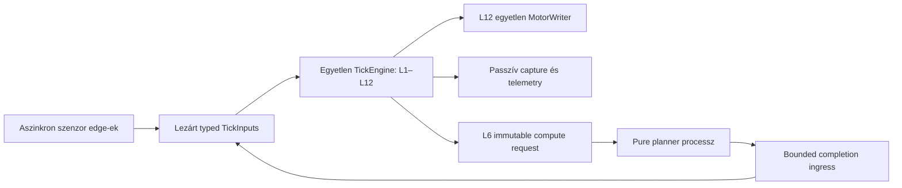

**Control loop: aszinkron működés elemzése és javítási terve**

2026-09-20. Ez tervezési dokumentum, nem az architekturális contract módosítása.
Az authority továbbra is a `STRUKTURALIS_RETEGEK_V3.md`. A vizsgálat kezdetén
a Git working tree tiszta volt. Production kód és konfiguráció nem változott.

**Döntési javaslat**

Az aszinkron bemenetek és a planner-eredmények átadásának szemantikáját érdemes
újratervezni. A teljes L1–L12 lánc párhuzamosítása nem indokolt: a jelenlegi
egyetlen TickEngine, rétegenkénti state-ownership és egyetlen L12 motorút
megtartható. A talált hibák főként abból erednek, hogy a korábban tickenként
érkező adatot több fogyasztó továbbra is ilyen adatként kezeli, miközben az
acquisition már saját frekvencián fut.

A javasolt cél: aszinkron edge-ek, a tick elején lezárt és visszajátszható
eredmények, egyetlen determinisztikus döntési lánc. A planner átadásának alább
ajánlott változata tudatos, körülhatárolt V3 contractmódosítást igényel.

**Bizonyított implementációs problémák**

1. **L11 egy normális, friss mintaismétlést terminális hibává alakít.**
   `v3/layers/l2_admission.py:94` helyesen DUPLICATE-ként kiszűri az ismételt
   encodermérést. L3 ezt már kezeli, de
   `v3/layers/l11_actuator_control.py:554` továbbra is pontosan egy új admitted
   `wheel_velocity` megfigyelést követel nem nulla célsebességnél.
   A teljes natív composition reprodukciójában a 2. tick 20 ms-os, egészséges
   ismételt encodermintája `L11_ERROR / FAULT` eredményt adott.
   Ez nem a szenzor hibája, hanem a fogyasztó hibás frekvenciafeltételezése.

2. **Az encoder-elmozdulás és az EKF predikció eltérő időintervallumokat ad össze.**
   `v3/adapters/multirate_inputs.py:420` csak a legutolsó látható snapshotot
   választja. A `counter_encoder.py:345` deltamérése az előző acquisitionhöz
   viszonyít; a köztes acquisitionök elhagyása ezért elmozdulást dobhat el.
   L3 közben minden control tickben predikál, majd az új delta érkezésekor azt
   ismét hozzáadja (`l3_state_estimation.py:535`, `:631`). A delta intervalluma
   részben már predikált időt is lefedhet.
   Két célzott L1→L2→L3 próba, egyenes 0,5 m/s mozgással, 40 ms alatt:
   köztes snapshot elhagyása esetén **0,01 m**, köztes predikció és későbbi
   40 ms-os delta esetén **0,03 m** lett az eredmény a **0,02 m** helyett.
   Pusztán a kumulatív count különbségére átállás az első hibát oldaná meg;
   a már predikált szakasz kétszeres elszámolását önmagában nem.

3. **A hiányzó friss kritikus measurementnek nincs teljes fogyasztói lejáratkezelése.**
   L0 új ellenőrzés nélkül visszaadja a korábbi snapshot health-jét.
   L2-ben a DUPLICATE megelőzi az age-vizsgálatot; L3 bootstrap után új IMU
   nélkül is halad. L12 az IMU esetén a közölt device health-re támaszkodik,
   míg a LiDAR safety korát külön újraszámítja.
   Natív compositionben, friss encoder/LiDAR és OK device health mellett,
   a **480 ms-os változatlan IMU-minta továbbra is ALLOW-t** eredményezett,
   noha az admission korhatár 250 ms. A rejection DUPLICATE maradt.
   A source oldali stale-vizsgálatok létezése nem pótolja a lezárt bemenetek
   fogyasztói garanciáját. A próba a pipeline által megengedett állapotot
   bizonyítja; ilyen konkrét élő driverhiba előfordulását nem bizonyítja.
   A DUPLICATE és STALE sorrendjének egyszerű felcserélése sem elég: a
   freshness-információnak ténylegesen el kell jutnia a megfelelő tiltásig.

4. **L6 átadása nem reprodukálható pusztán a jelenlegi lezárt bemenetekből.**
   `v3/layers/l6_navigation.py:1377`: időalapú módban, ha a handoff-határon
   nincs eredmény, L6 tovább használja a friss korábbi tervet, és egy későbbi
   tickben újra `backend.take()`-et hív. Így a worker/collector ütemezése
   választja ki az elfogadás tényleges tickjét. Ez ellentmond a V3 2. szakasz
   kizárólag lezárt TickContextből meghatározott handoff-követelményének.
   `v3/replay.py:898` a natív compositiont inline backenddel hozza létre;
   ott az eredmény már az első lehetséges határon rendelkezésre áll.
   Szintetikus, valódi CaptureSink→Replayer próbában az első eltérés:
   **tick 11, L6.trajectory_candidates[0].novelty_score, 0,5 → 0,142857…**.
   A meglévő `test_late_async_rollout_keeps_fresh_previous_plan` ezt a
   késleltetett live viselkedést teszteli, de nem vizsgálja a replay-egyezést.
   Ugyanilyen hiány a workerhiba/eredményhiány nem rögzített kimenetele is:
   a strict deadline visszaállítása önmagában nem tesz replayelhetővé minden
   workerhibás futást.

5. **L0 a publikálás előtti időt nevezi láthatósági időnek.**
   `v3/adapters/multirate_inputs.py:337` a source-read után időbélyegez,
   majd validál; a historyba csak a `:360–363` sorokon kerül be a snapshot.
   E kettő között a worker megállhat vagy deschedule-ölődhet.
   Kontrollált thread-interleavinggel: a tárolt visibility 2000 ns,
   a tényleges publikálás legkorábban 3000 ns; a 2500 ns-os control context
   mégis kiválaszthatta az új snapshotot, ha az L0 read később futott.
   Ugyanannak a contextnek előbb sequence=1, utóbb sequence=2 adódott.
   A measurement ideje, source-read befejezése és publikálás ideje itt sem
   cserélhető fel.

**További source-ból következő problémák és teljesítménykorlátok**

- **Minden új trajectory-mission első terve szinkron számolódik.**
  `l6_navigation.py:1275–1295` teljes rolloutot végez a control threaden akkor
  is, ha async engedélyezett. Ez szerkezeti akadálya a bounded ticknek;
  a jelen gépen szükséges legrosszabb futásidőt nem mértem. A worker warmupja
  csak üzenetváltás, nem ezt az első tervet végzi el.
- **A diagnosztikai tool nem követi az új L0 útvonalat.**
  `tools/r2b4_live_control_rootcause_diag.py:230–240` csak a
  `NativeLiveInputReader.read` metódust instrumentálja. Ez állítaná a globális
  `current_tick_id`-t is, amelyre a phase/runtime adatok támaszkodnak.
  Production multi-rate módban ez a hook kimarad. Emellett az analyzer
  `:464` körül acquisition sequence-eket control tick ID-ként kapcsol össze;
  a háttérben mért source-idők már nem a control L0 idő részidői.
  Így a source→tick korreláció és a residual-számítás érvénytelen lehet.
- **A CPU-affinity önmagában nem izolálja a Python munkát.** A vizsgált
  környezet CPython 3.11.2. A planner számítása külön processzben fut, de a
  request feeder, result unpickling, acquisition és capture több része ugyanabban
  a Python processzben marad. A külön CPU-ra pinelés a közös GIL-t nem szünteti
  meg. Ez valós mechanizmus, de a megfigyelt jitter domináns okának most nem
  bizonyított. [Python threading dokumentáció](https://docs.python.org/3/library/threading.html#gil-and-performance-considerations).
- **A kritikus lane-en az encoder, IMU és LiDAR olvasás soros.** Egy elakadó
  fizikai olvasás a lane többi forrását is késlelteti. Elsőként a driver timeoutot
  és stream-liveness kezelést kell rendezni; további lane/processz csak konkrét
  mért blokkolás miatt indokolt.
- **A control scheduler nem ugyanazt a kihagyási szabályt használja, mint az acquisition.**
  `v3_runtime.py:422` az előző tick kezdetéhez igazít; hosszú tick után közeli
  pótló tickeket engedhet. Ez növeli az ismételt input valószínűségét. Az
  acquisition `_next_period_deadline` már átugorja a kimaradt időréseket.
- **Planner-startup hiba esetén elmaradhat a sensor-owner lezárása.**
  `v3_hardware_runtime.py:731–748`: az owner létrejön, de a planner konstruktora
  a védő `try/finally` előtt fut. A cleanup határát ki kell terjeszteni;
  ezt a hibautat nem futtattam élő hardveren.

**Az újratervezés lehetséges mélysége**

| Változat | Mit old meg? | Következmény |
| --- | --- | --- |
| Szigorú, előre kijelölt planner-handoff megtartása | A sikeres eredmény elfogadási ideje determinisztikus. | Deadline-miss fail-closed; a hiány/workerhiba kimenetelét replay-inputként így is rögzíteni kell. Jitteres rendszeren sok indokolatlan megszakítás maradhat. |
| **Lezárt planner-completion mint typed tick-input – ajánlott** | A tényleges aszinkron érkezés explicit, rögzített bemenet; a control determinisztikus marad. | Célzott TickInputs/compute-port/capture/replay és V3 2. szakasz változás; L6 továbbra is egyedül dönt az elfogadásról. |
| L1–L12 rétegenkénti thread, processz vagy coroutine | Önmagában egyik talált időszemantikai hibát sem oldja meg. | Több állapottulajdonos, összerendelési és safety-probléma, lényegesen nagyobb V3 átépítés. A jelen evidence nem indokolja. |

Az `async def`-re átírás nem oldja meg a CPU-számítást, a blokkoló drivert,
az elveszett deltaméréseket vagy a rejtett worker-inputot.

A diagram planner-éle tervezett contractváltozás. A sensor/command ingress,
L6 semantic ownership, és L12 kizárólagos actuation authority megmarad.

**Javítási sorrend és elfogadási feltételek**

1. **A reprodukciók kerüljenek regressziós tesztbe, és javuljon a mérés.**
   Legyen teljes compositionteszt ismételt encoderrel, lejárt kritikus
   measurementtel, mindkét odometriai hibával és késő planner-completionnel.
   A timing hook a valódi control tick kezdetén kapjon contextet. Acquisition
   mérés külön source sequence-et és measurement/start/completion/publication
   időt használjon. Ne legyen háttér-source idők kivonása a control L0 idejéből.
   Ezek offline, GPIO nélküli tesztek.

2. **L0 publikáció és kritikus stream-frissesség.**
   A validáció legyen a publikáció előtt. A visibility timestamp, a historyba
   illesztés és a control snapshot cutoff képzése közösen definiált, rövid
   publikációs/zárási határt használjon. A timestamp lock alá mozgatása önmagában
   nem elég, ha a TickContext továbbra is ettől függetlenül, korábban létrejöhet.
   A publication korából számított stream
   liveness és a fizikai measurement korából számított capability freshness
   különüljön el. A DUPLICATE ne frissíthesse a measurement érvényességét;
   ugyanazon mérés újrapublikálása ne számítson új measurement érkezésének.
   Lejárt, valóban kötelező input vezessen explicit STOP/FAULT-hoz a meglévő
   canonical health/layer-fault/L12 utakon, az auxiliary ág önálló hibája ne.
   Tesztelendő a publikáció közbeni preemption, elakadt forrás, history-kimerülés
   és egészségesen ismételt minta. Nem helyes globálisan minden duplikátumot
   stale device-hibává alakítani.

3. **L11 és L3 többfrekvenciás szemantikája, külön javításokban.**
   L11 birtokolja az utolsó érvényes admitted wheel feedbacket, annak forrásidejét
   és minőségét. Bounded zero-order hold mellett a PI a control idővel lép;
   a cache újrafelhasználása nem hosszabbítja meg a measurement frissességét
   vagy a missing-feedback watchdogot. Új invalid/degraded feedback nem
   takarható el a régi jó cache-sel. A cache kerüljön checkpointba.
   A nulla cél és valódi feedback-lejárat meglévő fail-closed útja megmarad.
   L2 nem adhat be újra ugyanazt a megfigyelést csak L11 kedvéért.

   Az encoder input maradjon nyers kumulatív count/távolság + mérési idő.
   L3 az utolsó ténylegesen feldolgozott encoderméréshez viszonyítson, és a
   mérési intervallumra már elszámolt predikciót determinisztikusan korrigálja,
   ne adja hozzá újra a teljes deltat. Ehhez bounded mérésiidő-állapot/history
   szükséges L3-on belül és a checkpointban; nem külön estimator-worker.
   A pontos korrekciót először a meglévő EKF-re kell megtervezni, beleértve a
   kanyarodást és késő measurementet. Elfogadás: eltérő producer/control
   frekvenciák és fázisok mellett nincs elveszett vagy kétszer integrált RAW
   elmozdulás; frozen inputnál a freshness-policy ténylegesen tilt.

4. **Planner completion-határ cseréje a contracttal együtt.**
   L6 hozza létre az immutable requestet; a runtime bounded transporton
   továbbítja. A következő tick-input lezárása előtt az ingress rögzíti a már
   látható completiont vagy explicit hibát. Az L6 evaluate többé nem olvas
   futó workerből. A completion tartalmazzon logikai request/generation ID-t,
   source contextet és typed eredményt vagy hibát. L6 ellenőrizze a pending
   kéréshez, missionhöz és konfigurációhoz tartozást, valamint a forráskort.
   STOP vagy missionváltás után későn érkező régi eredmény nem fogadható el.

   Maradjon egy pending kérés és bounded transport; túlcsordulás, worker-exit,
   invalid completion és hard deadline explicit, rögzített kimenetel legyen.
   A terv frissessége a source snapshot idejéből számítandó. Ha a késő terv
   ideiglenes kivárását engedjük, annak külön, determinisztikus időkorlátja
   legyen; a friss régi terv nem jelent végtelen várási engedélyt.
   A source-kori feltételekhez képest lényegesen megváltozott mission/world
   esetén L6 invalidáljon, a meglévő L8/L12 korlátozások megmaradnak.

   Az első rollout is workerben fusson. Első érvényes tervig explicit
   planning-pending állapot és nulla mozgáskérés haladjon a canonical láncon;
   ne legyen szinkron seed kivétel. Ez új viselkedés, ezért a contractot és
   a readiness/timeout teszteket együtt kell módosítani.

   Capture őrizze a completion láthatóságát/hibáját és a szükséges pending
   checkpoint-state-et. Replay ugyanazon tickben tegye elérhetővé a completiont,
   a pure kernel eredményét pedig külön ellenőrizze ugyanabból a requestből:
   ne csak vakon injektáljon korábban rögzített L6 outputot. Legyen valódi
   persisted capture→canonical replay→Test Hub MATCH késő/hiányzó/hibás
   workereredményre, és negatív teszt módosított pure eredményre is.

5. **Scheduler, lifecycle és csak ezután teljesítmény-izoláció.**
   A control scheduler a befejezési idő alapján ugorja át a kimaradt periódusokat,
   ne generáljon pótló burstöt. A sensor-owner cleanup fedje le a planner-startupot
   is. A multirate kiválasztása legyen explicit runtime wiring, ne a clock callable
   identitásától függjön; a mostani `monotonic_ns is time.monotonic_ns` miatt
   sok fake-clock teszt automatikusan a szinkron útvonalat járja.

   Először motor-output nélküli terhelésméréssel különüljön el a source I/O,
   Python CPU/GIL, serialization, collector, control és capture költsége.
   Ha a közös GIL mérhetően akadályozza a 20 ms-os tickcélt, a nehéz edge
   feldolgozás/serializáció kerüljön processzhatár mögé kompakt bounded
   payloadokkal. További processzek vagy shared memory előzetes mérés nélkül
   nem indokoltak. A command ingress fennmaradó fájl-I/O-ját is külön kell
   mérni; a szenzorok kiszervezése nem teszi a teljes tickutat I/O-mentessé.

**V3-változás és végső validáció**

A planner-ajánlás megváltoztatja a determinisztikus handoff feltételét és a
production execution bemenetét. A `STRUKTURALIS_RETEGEK_V3.md` 2. szakaszát,
az érintett adatél-leírást és a 11.2 replay-feltételeket a source-szal együtt
kell módosítani. Azonos lezárt inputból azonos output, rétegenként egy owner,
egy L12 final és egy normál motor-write továbbra is kötelező. A L3/L11
bounded saját state és freshness javítása önmagában nem igényel új authorityt.

A tényleges javítás több réteget, execution/capture boundaryt és motort
befolyásoló útvonalat érintene: a célzott kapuk után teljes regresszió szükséges.
Friss javítás utáni capture-rel kell exact MATCH-et igazolni; egy ismerten hibás
régi futás outputjával való szándékos eltérés nem nevezhető MATCH-nek.
Timing-elfogadásnál külön mérendő idle, első aktív tick, tartós aktív futás,
missionváltás és capture-terhelés. Átlagos Hz helyett p95/p99/max, deadline-miss,
source age és eredményátadási latency is kell. Konkrét latency-keretet a
20 ms-os control cél és mért hardveres tartalék alapján kell rögzíteni.
Fizikai mozgásos acceptance csak külön, aktuális felhasználói engedéllyel,
a canonical runtime/safety úton történhet.

**A most elvégzett ellenőrzések és korlátaik**

- Meglévő célzott suite: **44 passed**. Fájlok: `test_v3_async_l6_planner.py`,
  `test_v3_l6_planner_process.py`, `test_v3_multirate_inputs.py`,
  `test_v3_multirate_l3_integration.py`, `test_v3_native_control_composition.py`,
  `test_v3_tick_engine.py`. A zöld eredmény mellett a fenti öt hiány reprodukálható.
- Hardver nélküli külön próbák: encoder-duplicate FAULT, frozen IMU ALLOW,
  elveszett/kétszer elszámolt távolság, publikációs versenyhelyzet; szintetikus
  persisted capture-rel canonical planner-replay MISMATCH.
- Meglévő élő MCAP canonical replay: `v3_20260920_134724_12154_capture.mcap`,
  840–845. tick, checkpoint/prefix warmuppal. **MISMATCH**, első eltérés tick 842,
  `L6.trajectory_candidates[0].min_clearance_m`: rögzített
  `0.14637555633593113`, aktuális replay `0.13207359060161789`.
  Ez közvetlen replay-evidence. A konkrét élő eltérés workerütemezési oka
  külön transport evidence nélkül nem tekinthető bizonyítottnak.
- A 14:42-es futás korábbi `LIDAR_SAFETY_INVALID` hibájának javítása már benne
  van az aktuális L12-ben, és a célzott tesztje átment. Ezt nem sorolom új,
  javítatlan hibaként. Annak capture-je csak egy mozgáskérést és nulla ALLOW-t
  mutatott: közel 20 ms-os idle timingja nem bizonyít tartós aktív működést.
- A megnyitott 13:47-es diagnosztikai JSON `confidence=INCOMPLETE`, nulla
  analizált aktív tickkel. Nullás timing mezői nem bizonyítanak nulla költséget.
- Production változtatás, új live futás, robotmozgás, teljes regresszió nem volt.
  Az aktív hardveren elérhető jitter, a fizikai mozgás minősége és a javítások
  eredményessége még nincs bizonyítva. A felsorolt hibák jelenleg javítatlanok.
- Ideiglenes eredmények: `/tmp/r2b4-async-review-xuhmbzn3/results.json`,
  `/tmp/r2b4-async-review-xuhmbzn3/late-planner-replay.json`,
  `/tmp/r2b4-async-native-replay-eb5l1sim/replay.json`.
  A meglévő runtime/capture/diagnosztikai fájlokat nem módosítottam.
