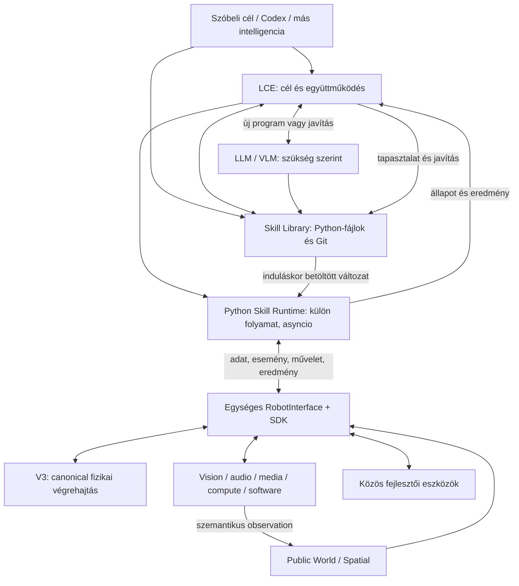

# R2B4 — nyitott Skill/Interface, Python Skill Runtime és LCE–LLM együttműködés

Dátum: 2026-10-10. Állapot: a programfuttatóról és a túlszabályozásról adott felülvizsgálat alapján módosított terv. Az új SDK, Skill Runtime és skillkönyvtár még nincs implementálva.

## 1. A kívánt végállapot

**Az R2B4 egyszemélyes K&F robotikai platform: bármely csatlakozó kognitív intelligencia ugyanazon teljes RobotInterface-en használhatja a robot képességeit, és közönséges Python-skilleket hozhat létre, módosíthat, tesztelhet, menthet és futtathat. A skillek később helyben, a létrehozó intelligencia folyamatos közreműködése nélkül működnek.**

A megoldható viselkedések körét nem előre összeállított feladatlista határozza meg. Az LLM új algoritmust, feltételt, ciklust, függvényt, osztályt, állapotkezelést és érzékelésre reagáló viselkedést írhat. A program használhatja a teljes Python nyelvet és a telepített könyvtárakat. A tényleges robotképességeket a közös SDK teszi elérhetővé.

A szóban létrehozott és a Codexszel vagy VS Code-ban szerkesztett skill **ugyanaz a `.py` program**. A fejlesztési modell laboratóriumi próba–eredmény–javítás ciklus; az új skillréteg nem vezet be külön runtime/developer jogosultsági hierarchiát vagy többszintű aktiválást.

Az LCE a meglévő `BrainCore` célgazda és végrehajtási felügyelő. A V3 a fizikai végrehajtás és safety ownere. Egyszerre egy fizikai mission lehet, a mozgás a canonical úton történik, a STOP a skilltől és az LLM-től függetlenül működik. Ezek a robot működési alapjai.

**Az LLM elérhetősége soha nem előfeltétele egy már elindított helyi skill folyamatos végrehajtásának.** Nyolcórás zavartalan megfigyelés, helyi detector és eseményfelvétel alatt a kívánt LLM-hívásszám nulla.

Ez a változat lecseréli a korábbi saját Python-részhalmazt, AST-interpretert, rekurziótilalmat és utasításonkénti erőforrás-elszámolást szabványos Pythonra és egyszerű folyamatfelügyeletre. A TaskGraph és a meglévő behaviorök kompatibilis eszközök maradnak. A [korábbi LCE-terv](LOCAL_COGNITIVE_EXECUTIVE_PLAN.md) memória/identity/spatial eredményei továbbra is alapot adnak.

Authority: [rendszerszintű működési contract](../R2B4_SYSTEM_BEHAVIOR_CONTRACT.md), [V3 struktúra](../STRUKTURALIS_RETEGEK_V3.md), [async runtime contract](../ASZINKRON_RUNTIME_CONTRACT_V3.md). A kívánt Python-skill és közös fejlesztői működéshez szükséges célzott contract-változás a 14. fejezetben szerepel. A live contractok és production source ebben a tervezési munkában nem változnak.

## 2. A kutatási elvek R2B4-re szabott kombinációja

| Kiindulópont | Átvett elv és elsődleges forrás | R2B4-megvalósítási irány |
| --- | --- | --- |
| SayCan | A nyelvi tervet a robot valódi skilljeihez és aktuális végrehajthatóságához kell kötni. [Tanulmány](https://arxiv.org/abs/2204.01691) | Egységes képességleírás, precondition, friss állapot és authoritative műveleteredmény |
| SayPlan | Releváns térbeli részgráf, helyi úttervező és végrehajtási visszacsatolás segíti a hosszú feladat tervezését. [Tanulmány](https://arxiv.org/abs/2307.06135) | Public World/Spatial szelet; V3 navigáció; konkrét eredményből indokolt újratervezés |
| Code as Policies | A modell programot írhat, amely perception outputot dolgoz fel, függvényeket és visszacsatolt ciklusokat használ. [Tanulmány](https://arxiv.org/abs/2209.07753) | Generált felső behavior-program typed robot API-val; feltételek, ciklusok és saját lokális logika |
| Voyager | Eltárolt végrehajtható skill-könyvtár, visszakeresés és execution feedback alapján javított programok. [Tanulmány](https://arxiv.org/abs/2305.16291) | Paraméterezett, verziózott programok; kvalifikált eredmény; javítás és új helyi felhasználás |

Ez architekturális adaptáció. A Voyager Minecraftban bemutatott működése nem bizonyít fizikai robot-safetyt; a Code as Policies alacsony szintű control-példái nem kerülnek át a V3 alá vagy helyére. A konkrét runner, felület és validáció az R2B4 source-ára és erőforrásaira épülő javaslat.

## 3. Source-alapú kiindulópont

| Terület | Meglévő alap | Célzott bővítés |
| --- | --- | --- |
| Közös facade | [`RobotInterface`](../v3/robot_interface.py): adapteres `capabilities/read/query/spatial_query/execute/stop`, élő supported/available/ready | Egyszerű közös descriptor; esemény, műveleteredmény és dinamikus skillkatalógus |
| Host wiring | [`PublicRobotRuntime`](../r2b4_orchestration/robot_runtime.py): közös felület Brain/Behavior felé, közös World/Spatial | A Skill Runtime bekötése a meglévő hostba; lifecycle és non-motion invocation |
| Kliens/transport | Ugyanitt `PublicRobotClient`: szinkron UNIX-socket request/reply | Kis async SDK-adapter és célzott event/result/skill műveletek |
| Leírások | [`ActionDescriptor`](../v3/action_catalog.py), [`person_skills.py`](../r2b4_orchestration/person_skills.py), host és Agent külön műveletlistái | Egy katalógusból származó kliensfelület; új skillhez ne kelljen új allowlist |
| LCE | [`BrainCore`](../r2b4_orchestration/brain_core.py): goal, priority, admission, generation, cancellation és results | Python-skill-hivatkozás, eredménykezelés és szükség szerinti javítás |
| TaskGraph | [`TaskGraph`](../r2b4_orchestration/task_graph.py): bounded DAG | Meglévő egyszerű terveknél marad; Python-ciklust nem kell DAG-gá fordítani |
| Behavior | [`BehaviorSystem`](../r2b4_orchestration/behavior_system.py): trusted Python `start/step`, explicit factory | Vékony adapter a külön Python-folyamat indításához és állapotához |
| Mai korlát | Egy aktív program; command identity és friss `v3.status`; maximum 3600 s | Non-motion skill saját futásazonosítóval, hosszú helyi élettartammal |
| Agent | [`AgentCore`](../r2b4_orchestration/agent_core.py), [`ConversationService`](../r2b4_voice/conversation_service.py): on-demand provider | Valódi Python írása/javítása és meglévő skill kiválasztása |
| Tanulás/tárolás | [`OutcomeLearner`](../r2b4_orchestration/outcome_learning.py): eredményalapú prior; host World/Brain/Spatial mentés | Közös `.py` könyvtár és egyszerű skill-eredményösszesítés |
| Esemény | `_world_event` / `_behavior_event` ébreszti a Braint; külön passive ObservationHub | Egyszerű producer-esemény az SDK felé; eredmény visszakérdezése |
| Kamera/media | [`vision_owner.py`](../v3/adapters/vision_owner.py), [`camera_media.py`](../v3/adapters/camera_media.py): demand-driven kamera, fix idejű szinkron videó | Aszinkron observer/recorder a meglévő owner körül |
| Személy/tér | [`person_identity.py`](../r2b4_orchestration/person_identity.py), [`SpatialService`](../r2b4_orchestration/spatial_service.py) | Szükség szerint önálló XY-újraazonosítás és current atlasz-alignment |

A mai `register()` nem tesz egy új skillt automatikusan minden kliensből elérhetővé. A socketes API ma nem kész eseményelőfizetés vagy Python-skill-futtató. A szinkron `PublicRobotClient.request()` nem hívható közvetlenül az asyncio event loop blokkolásával; kezdetben kis thread-wrapper is elegendő lehet a rövid I/O-hívásokhoz. Hosszú observer/media munka az owning szolgáltatásban fusson, handle/result kapcsolattal.

A mai BehaviorSystem motionhoz kötött feltételeit nem lehet hamis `command_id`-val megkerülni. Helyi megfigyeléshez külön invocation lifecycle kell; ehhez a meglévő host/adapter bővítendő, a stabil behaviorök széles átírása nélkül.

A művelet elfogadása, tényleges befejezése, a skill visszatérési értéke és az emberi cél teljesülése külön állítás. A mai `RobotInterfaceEvent.ACTION_RESULT` az adapterhívás visszatérése; ez capabilitytől függően acceptance vagy completion lehet.

## 4. Architekturális felelősségek

| Felelősség | Feladat |
| --- | --- |
| V3 | L0–L12, navigation/recovery, fizikai realizáció és final safety; soha nem vár LLM-re |
| LCE / BrainCore | Emberi és K&F célok, prioritás, skillválasztás, indítás, eredményértékelés és szükség szerinti LLM-együttműködés |
| RobotInterface + Python SDK | Teljes képességkatalógus; read/query/call/event/result; közös fejlesztői eszközök |
| Python Skill Runtime | Külön folyamatban futó szabványos Python, asyncio, indítás/leállítás/állapot/eredmény |
| Skill Library | `.py` fájlok, rövid leírás, tesztek, Git-történet és egyszerű eredménynapló |
| LLM/VLM | Új program és stratégia, javítás, nehéz értelmezés, szükség szerint |
| Public World / Spatial | Közös szemantikus memória és térbeli referencia; a V3 operational worldje továbbra is saját |

Ez felelősségfelosztás, nem új számozott rétegrend. Az egyetlen production layer-sorozat továbbra is V3 L0–L12.



Minden felső intelligencia ugyanazt a teljes képességszemantikát használja. A CLI, LCE, LLM, GUI, más planner és Codex számára nem készül külön robot API vagy új felső jogosultsági rendszer. A célgazda és a fizikai ownerek a meglévő helyükön maradnak.

## 5. Egységes, dinamikusan bővíthető Skill/Interface

### 5.1 A teljes képességkészlet

Az interface a meglévő RobotInterface továbbfejlesztése; a Python SDK ennek kényelmes, aszinkron kliense. A képesség implementációja az owning adapterben/service-ben marad.

| Domén | Elérhetővé teendő képességek |
| --- | --- |
| Fizikai | Navigáció, relatív mozgás, fordulás, követés, STOP és ténylegesen telepített további actuator |
| Érzékelési | Kamera, detector, hang/voice és releváns szenzor/perception adat |
| Számított | Pose/quality, geometria, world, térbeli feloldás, identity, object/event recognition, telepített compute |
| Szoftveres | HRI/report, memória, media, health/diagnosztika, Linux- és fájlműveletek, source/config szerkesztés és tesztfuttatás |
| Megtanult | Paraméterezett Python-skillek, listázás, indítás, leállítás, eredmény és módosítás |

A kapcsolódó kognitív rendszerek közös fejlesztői eszközöket is használhatnak. Nem kell minden funkcióhoz runtime/developer szerepkört vagy új engedélyt definiálni. A szolgáltatások megtartják saját működési szabályaikat: egy estimator olvasása és annak támogatott beállítása két külön API-művelet; az interface nem teszi önkényesen írhatóvá a belső V3 state-et.

### 5.2 Egyszerű közös descriptor

Kötelező mezők: **név, rövid leírás, paraméterek, eredmény és elérhetőség**. Ebből származik a discovery, a klienshívás leírása és az LLM releváns katalógusrészlete. Az owning adapter a routing része, nem új nyilvántartási vagy jogosultsági platform.

Mértékegység, eseménytípus, hosszú művelet handle-je, cancel, readiness-részlet vagy adatminőség csak az érintett képességnél szerepeljen. Egy egyszerű `audio.speak` nem kap kötelező teljes erőforrás-, bizonyítási és életciklus-adatmodellt. Az élő availability/readiness továbbra is a valódi ownerből jön.

### 5.3 Közös műveletek és hat skillfunkció

| Felület | Működés |
| --- | --- |
| Capability discovery | A teljes katalógus és releváns részleteinek lekérdezése |
| `read` / `query` | Aktuális állapot vagy paraméterezett számított adat |
| `call` | Action/compute indítás; azonnali eredmény vagy hosszú művelet handle-je |
| Eseményfeliratkozás / `events.wait` | Kiválasztott producer-események és fontos állapotváltozások |
| Műveletállapot / eredmény | A hosszú művelet visszakérdezhető állapota és eredménye |
| `cancel` / `close` / robot `stop` | Művelet/session lezárása; a robot STOP-ja a canonical úton |

| Skillfunkció | Működés |
| --- | --- |
| `skill.list()` | Könyvtári skillek és leírásuk |
| `skill.create()` | Új `.py` skill és opcionális rövid leírás mentése |
| `skill.run()` | Paraméterezett futtatás; futásazonosító visszaadása |
| `skill.stop()` | Futó skill megszakítása; saját aktív mozgásának canonical leállítása |
| `skill.status()` | Állapot, eredmény vagy hiba lekérdezése |
| `skill.update()` | Új forrásváltozat mentése; a futó programot nem reloadolja |

A nevek tervezett API-k, még nem mai CLI-parancsok. A tesztelés a közös fejlesztői eszközök és a meglévő pytest-folyamat része; nem kell külön validate/store/promotion platform. A mentett `.py` fájl maga a tartós skill.

A mai `capabilities/read/query/spatial_query/execute/stop` út kompatibilis marad. Új skill descriptorát a könyvtár publikálja, core factory- vagy kliens-allowlist-módosítás nélkül. Új hardver/compute bekötése konkrét owning adaptermunka; ehhez sem kell új általános plugin- vagy transport-framework.

## 6. Kétirányú, eseményvezérelt együttműködés

A kognitív kliens és a Python-skill ugyanazon felületen figyeli a környezetet és a robot belső működését. Eseményre reagálhat, friss adatot kérhet, műveletet indíthat, és annak eredményét visszakérdezheti.

Az alap egyszerű: eseményfeliratkozás, eseményazonosító, műveletazonosító és visszaolvasható utolsó állapot/eredmény. Fontos rövid eseményt az owner ne csak pillanatnyi latest-state felülírással közöljön. A kliensnek nem kell minden eseményhez goal/program/API revision-mátrixot vezetnie.

Hosszú megfigyelésnél, például az éjszakai kamerafeladatban, szükség van sorszámra, duplikációkezelésre és a kiesés jelzésére. Más egyszerű skillekhez nem kötelező részletes coverage- vagy event-loss statisztika. A queue és transport nem nőhet korlátlanul; a konkrét owner olyan egyszerű megoldást használjon, amely a feladat fontos eseményeit és a veszteséget kezelni tudja.

A producer eredeti measurement ideje és adatminősége megmarad, ahol ez a döntéshez szükséges. A passive ObservationHub, capture és telemetria megfigyelési infrastruktúra marad; nem alakítjuk át command- vagy döntési busszá. V3 decision-input esetén a meglévő completion → closure → immutable TickInputs szabály változatlan.

Kép, scan, map és video közvetlenül az owning producer/fogyasztó úton vagy asset/stream referenciával érhető el. Nagy raw payload nem kerül a Brain vagy a control critical path közepére. Egy SDK-képesség async volta nem teszi a mögöttes szinkron I/O-t automatikusan nem blokkolóvá.

Az LCE továbbra is a felső célgazda. A futó skill műveletei annak aktív futásához kapcsolódnak; nem indul minden lépésnél új emberi goal. A meglévő manual preemption és az egy aktív fizikai mission működése megmarad.

## 7. Szabványos Python-alapú Skill Runtime

**A skill valódi Python-modul, javasolt belépési pontja `async def run(robot, **parameters)`.** Szabadon használ függvényt, osztályt, feltételt, ciklust, rekurziót, kivételkezelést, modulokat, telepített könyvtárakat, fájl- és Linux-funkciókat. A robotkapcsolatot a közös Python SDK adja. Type hint és lint segítheti a fejlesztést, de nem külön programnyelv vagy kötelező saját típusellenőrző.

A futás és várakozás a szabványos Python/`asyncio` feladata. A folyamatindítás és leállítás a szokásos subprocess-eszközökre épül. Saját AST-végrehajtómotor, folytatható IR, utasításszámláló és rekurziótilalom nem készül. A robot meglévő Python-környezetére építünk; nem követelmény a mellékletben szereplő konkrét új Python-verzió. [Python asyncio dokumentáció](https://docs.python.org/3/library/asyncio-task.html), [subprocess dokumentáció](https://docs.python.org/3/library/asyncio-subprocess.html).

### 7.1 Folyamatelhelyezés

A javaslat a külön folyamat és a tartós async worker kombinációja:

- A meglévő host/LCE egy aktív skillt vagy összetartozó skillcsoportot felügyel; a tényleges Python-kód külön Skill Runtime-folyamatban fut.
- A worker asyncio-feladatként kezeli a megfigyelést, reakciót és részskilleket. Egy nyolcórás feladat alatt tartósan él; nincs processzindítás minden eseménynél vagy lépésnél.
- Az első változatban új felső invocation indulhat friss workerrel. A worker több cél közötti újrahasználata csak akkor szükséges, ha az indítási költség ezt indokolja.
- CPU-igényes vagy külön megszakíthatóságot igénylő munka saját folyamatba kerülhet. A már meglévő vision/media/compute ownereket használjuk, nem duplikáljuk őket.

Egy közös asyncio event loopban a blokkoló vagy végtelen Python-ciklus minden ottani feladatot megakaszthat. A külön folyamat ezt a hibát elkülöníti a V3-tól és a célgazdától; ugyanazon worker skilleit nem izolálja egymástól. A host felügyelete a workeren kívül marad.

### 7.2 Indítás, állapot, eredmény és leállítás

A szükséges runtime-szerződés kicsi: indítás, futásazonosító, állapot, visszatérési érték/hiba és leállítás. Az invocation azonosítója a már létező behavior-generation/revocation működéshez kapcsolódik. Leállított futás késői actionkérése nem indíthat új mozgást; ez végrehajtási korreláció, nem új szerepkörrendszer.

A host STOP vagy workerhiba esetén megszünteti az érintett felső intentet, és szükség szerint canonical V3 STOP-ot küld. Ez nem vár a worker együttműködésére. Utána kérhet normál task cancellationt és cleanupot, majd rövid várakozás után terminate/kill útján leállíthatja a beragadt folyamatot és annak saját gyermekfolyamatait.

A `Task.cancel()` együttműködő megszakítás; önmagában nem állít meg egy nem yieldelő ciklust. A Python-process megszüntetése pedig nem von vissza egy korábban elfogadott fizikai parancsot. A robotleállítás és a process-cleanup ezért külön feladat. Megszakításkor a worker `finally` blokkja segíthet, de crash esetén a hostnak/ownernek kell elengednie a futás saját session/demandjeit. [Python task cancellation](https://docs.python.org/3/library/asyncio-task.html#task-cancellation).

Futási idő, memória, CPU-terhelés, stdout/stderr és gyermekfolyamat figyelése szükség szerinti folyamatfelügyelet. Nem számolunk minden Python-utasítást és nem korlátozzuk a nyelv adatstruktúráit. A Pi terhelése és a robot megszakíthatósága mérési kérdés.

### 7.3 Megbízható fejlesztői kód

A teljes Python a K&F környezetben megbízható fejlesztői kódként fut. A külön folyamat meghibásodási és GIL-izoláció, **nem biztonsági sandbox**. A robotmozgásra a közös SDK és a canonical V3 út használata az architekturális szabály. Közvetlen motor/GPIO vagy belső V3-handle nem része az SDK-nak; teljes Python esetén ezt a processzhatár önmagában nem kényszeríti ki.

Az új skillréteghez nem építünk külön OS-sandboxot vagy jogosultsági platformot. A szabványos Python fejlődési lehetősége és a V3 kontrollja így világosan elválik: a V3 a rajta áthaladó fizikai műveleteket felügyeli, nem a Python összes fájl-, Linux- vagy fejlesztői műveletét.

## 8. LCE–LLM együttműködés és programjavítás

| Helyzet | LLM szükséges? |
| --- | --- |
| Ismert skill futtatása, normál navigation/motion | Nem |
| Helyi detector-esemény és megírt reakció | Nem |
| Ismert hiba helyi kezelése | Nem |
| Új összetett cél vagy új Python-skill | Lehet / általában igen |
| Helyben megoldhatatlan helyzet | Ha segíthet |
| Összetett eredmény értelmezése | Opcionális |

Az LLM-hívás döntési szükségletből indul; nem időalapú polling, nem minden képkocka vagy behavior-lépés következménye.

A GoalSpec megtartja a teljes emberi célt, idő/hely/identity/mozgási feltételeket és a feltételes kötelezettségeket. Az LLM és az LCE ugyanazon célon dolgozik. Javításkor a már teljesült műveletek és az aktuális probléma kerülnek a kontextusba; a javítás nem írja át az emberi kérést.

A rövid request tartalma: goal, az LCE konkrét kérdése, releváns robotállapot és API, használt skill/source, eddigi eredmény, hiba és releváns könyvtári példák. Egy goalhoz egy aktív tervezési/javítási kérés elegendő. A meglévő goal/generation cancellation és request ID kiszűri a STOP vagy célváltás után visszaérkező választ; nincs külön program/library/API/cursor revision-ellenőrzési platform.

Válaszfajták: `use_skill`, `create_skill`, `update_skill`, `query`, `clarify`, `infeasible`, `answer`. A create/update válasz skillnevet, Python-source-t, paramétereket, rövid leírást és szükség szerint tesztet tartalmaz. A külső válaszschema lehet szigorú; ez nem korlátozza a Python nyelvet.

**Egy futás az induláskor betöltött `.py` változatot használja.** Fájlmódosítás nem reloadolja a futó modult. A javított változat következő indításkor, vagy lezárt részfeladathatáron, ismert paraméterekkel és eddigi eredményekkel indul. Első változatban nincs stack-, coroutine- vagy tetszőleges programállapot-migráció.

Megállás után az LCE eldönti, mely részfeladat maradt el; a sikeres mozgást vagy más mellékhatást nem ismétli meg automatikusan. Bizonytalan részleges mozgásnál friss állapotot és canonical eredményt kér. A source-változat azonosítása egyszerű file/hash vagy Git-hivatkozás; nem teljes függőségi registry.

LLM-kieséskor a helyben futó skill és az ismert reakciók folytatódnak. A helyben nem megoldható rész felfüggeszthető, a robot megőrzi az eredményeket és valós állapotot jelent. Workerhiba nem indít automatikus mozgás-újrapróbálást.

STOP a canonical úton azonnal revokálja a felső intentet. Restart után a skillek és az eredmények megmaradhatnak, a korábbi aktív goal `INTERRUPTED`/`CANCELLED`; nem indul újra automatikusan. Explicit folytatás friss állapotból és az eddigi fizikai hatások figyelembevételével történik.

## 9. K&F próba és skillfejlődés

A fejlesztési ciklus: **szóbeli instrukció / Codex / más intelligencia → Python-skill → automatikus helyi próba → eredmény és javítás → mentés → későbbi önálló futtatás**.

A laboratóriumi K&F működés az alapértelmezett fejlesztési modell. Új skill létrehozásához, módosításához, mentéséhez és helyi teszteléséhez nincs új többszintű jóváhagyás. Az LCE kísérleti célban saját maga is kezdeményezhet próba- és javítási feladatot; ez a meglévő goal/prioritáskezelésen keresztül fut. Az új skill nem igényel kézi factory deploymentet.

A kísérleti robotüzem és egy konkrét ügyviteli feladat eltérő célt adhat. A robotikai próba is a V3 útját, az egy fizikai mission szabályát és a STOP-ot használja. A mostani feladat tervmódosítás: e munkában nem indul fizikai próba.

A vizsgálat a konkrét skillhez igazodik: szintaxis/import és indítás, néhány érdemi eseménysor, megszakítás, visszatérési eredmény, majd szükség szerint tényleges robotikai próba. A program és az LLM készíthet tesztet. A sikeres pytest és a tényleges cél teljesülése külön eredmény; a `return {"success": True}` nem bizonyítja a csapdaajtó zárását.

A tanulás lehet új programlogika, paraméterezés, jobb eseményreakció vagy keresési stratégia. Az eredményekből egyszerű siker/hiba/költség összevetés készüljön. Sikertelen javítás visszaállítható; nem kell minden skillhez teljes bizonyítási vagy aktiválási csomag.

## 10. Egyszerű Skill Library és közös fejlesztői munkafolyamat

Egy skill kezdetben **egy `.py` fájl**, mellette opcionális rövid leírófájl és indokolt teszt. A minimális leírás a név, cél, paraméterek és visszatérési érték; ez docstringből vagy a leíróból is jöhet.

Például, az első implementációban kijelölendő közös könyvtárban:

```text
robot_skills/
    monitor_region.py
    monitor_region.md             # opcionális
    tests/test_monitor_region.py  # ha érdemi teszt szükséges
```

Ez tervezett elhelyezés, nem most létrehozott fájlszerkezet. A szóban generált és a Codex által szerkesztett program ugyanide kerül, ugyanazzal az SDK-val fut. A Git kezeli a forrástörténetet; a működő munkafa-változat commit nélkül is futtatható. Automatikus commit/push nem része a rendszernek.

A futtató a konkrét betöltött source-változatot azonosítja, és a modul betöltése a workerben történik; a katalógus felépítése nem importál tetszőleges skillkódot a control vagy a Brain folyamatába. A módosított program friss indításkor töltődik be. A belépési fájl azonosítása nem jelent teljes Python-környezet- vagy függőségfagyasztást.

Mért eredmények külön kis host-naplóban tárolhatók: skill, futás, eredmény/hiba, idő és releváns körülmények. Nincs kötelező executable asset/index/domain registry, részletes API-dependency nyilvántartás vagy minden hívást felölelő adatmodell. Meglévő runtime/capture/log adatot nem másolunk Gitbe és nem törlünk automatikusan.

A library új `.py` skillje ugyanazon interface-en jelenik meg. Mentési hiba látszódjon; a robot ne állítsa, hogy egy nem mentett skill restart után is megmarad. Egy konyhai egérmegfigyelés eredménye önmagában nem állítás más detector vagy szoba minőségéről; ehhez elegendő a leírás és a konkrét teszteredmény, új kötelező doménregiszter nélkül.

A visszakeresés kezdetben név/alias/leírás/paraméter és egyszerű helyi keresés. Ismert skill és paraméterezés LLM nélkül indítható. Új szabad nyelvi megfogalmazás értelmezéséhez továbbra is kellhet LLM; a voice STT hálózatfüggése ettől külön kérdés. Embedding vagy nagy helyi modell nem előfeltétel.

## 11. Szabványos Python-példa: hosszú megfigyelés

Az alábbi `.py` skill tervezési példa. Az `asyncio` valódi Python; a `robot.observe`, `robot.media` és `robot.events` még fejlesztendő SDK-hívások, nem meglévő production API-k. A context managerek a saját observer/recorder igényt nyitják és engedik el.

```python
import asyncio


async def run(robot, region, object_kind="mouse", duration_hours=8):
    async with robot.observe(region=region, object_kind=object_kind) as observer:
        async with robot.media.event_recorder(observer) as recorder:
            loop = asyncio.get_running_loop()
            deadline = loop.time() + duration_hours * 3600
            events_found = 0
            coverage_gaps = 0

            async def handle_event(event):
                nonlocal events_found, coverage_gaps
                if event.kind == "qualified_presence":
                    await recorder.start_event_clip(event)
                    events_found += 1
                elif event.kind == "coverage_gap":
                    coverage_gaps += 1
                elif event.kind == "capability_failed":
                    raise RuntimeError(event.reason)

            while True:
                remaining = deadline - loop.time()
                if remaining <= 0:
                    break
                event = await robot.events.wait(observer, timeout_s=remaining)
                if event is None:
                    break
                await handle_event(event)
            async for event in observer.finish_events(until=deadline, timeout_s=5):
                await handle_event(event)
            media_result = await recorder.finish(timeout_s=5)
            return {
                "events_found": events_found,
                "coverage_gaps": coverage_gaps,
                "media": media_result,
            }
```

A `start_event_clip` csak az indítás elfogadására vár, handle-t ad; a recorder önállóan rögzít és követi a clipet. A program így közben új eseményre és csapdareakcióra is reagálhat. A `finish` a felvételek lezárását/eredményét összesíti; ha a példabeli idő alatt ez nem kész, partial eredményt ad. A context-manager cleanup nem akadályozhatja a host külön STOP/process-leállítását.

A `finish_events` a megfigyelési képesség célzott lezárási művelete: még átadja a határidő előtt mért, korábban nem kezelt eseményeket, majd lezárja az intervallumot. Az SDK a helyi deadline-t az observer időalapjához egyezteti, megőrzi az eredeti mérési időt, és kiesést jelez, ha az események feladatvégi feldolgozása a megadott idő alatt nem kész. Ezekből az eseményekből is indulhat clip; ezért a recorder csak ezután finalizál. A feladat időtartama nem hosszabbodik meg a feldolgozás/felvétellezárás idejével. Ez a hosszú megfigyelés részlete, nem általános skill-adminisztráció.

A két context manager sikeres belépése observer/recorder READY állapotot jelent. A nyolc óra a minősített watch-position és ezen readiness után indul. A konkrét hosszú megfigyelési szolgáltatás megtartja a mérési időket, elő-/utópuffert, kieséseket és a feladatvégi felvételeket; ezek az observer/media képesség részletei, nem minden skill kötelező sémái. A program helyi monoton deadline-ja nem írja át a kamera measurement idejét.

Ebből új Python-logika írható: két esemény együttállása, számláló, változó nézőpont, helyi újraellenőrzés vagy részskill indítása. Nincs kötelező teljes watch-factory. A kamera→helyi detector→esemény→felvétel út nyolc órán át nulla szükséges LLM-hívással működik a kívánt rendszerben.

A 10–15 feldolgozott frame/s mérési cél, nem bizonyított RPi5-garancia. Egérdetektor, éjszakai képminőség és esemény teljes rögzítése külön képesség/minőség kérdése. Detector-kiesés vagy üres observation nem bizonyítja, hogy nem volt egér.

A csapdás változat egyszeri reakciót és saját `trap_triggered` állapotot tarthat, miközben a recorder tovább él. A mai `move_relative(-0.15)` mögöttes célpose-ra navigál; nem garantál egyenes tolatási pályát. Szükség esetén szűk canonical reverse-constraint kell. Sikeres mozgás nem bizonyítja a csapdaajtó tényleges állapotát.

Az „egy helyben” megfigyelés és a feltételes tolatás a cél két összefüggő feltétele. Tolatás után a látómezőt újra kell értékelni; ismételt trigger/re-arm vagy hiányzó mechanikai kapcsolat feloldandó adat. A Python-program nem teremt hiányzó fizikai vagy érzékelési képességet.

## 12. További behaviorök és érzékelési visszacsatolás

| Emberi cél | Az intelligencia által generálható új logika | Szükséges valós capability |
| --- | --- | --- |
| XY keresése a konyhában, találat után visszatérés/jelentés | Nézőpontsorrend, keresési ciklus, identity+room feltétel, origin megtartás, negatív ág és report policy | Qualified XY identity, helyfeloldás, canonical navigation és report delivery |
| XY érkezésekor odamenni és szólni | Event-filter, személyválasztás, egyszeri interaction/re-arm feltétel, megszólítás | Arrival/identity evidence, current target, HRI |
| Lakásbejárás és nyitott ajtók ellenőrzése | Viewpoint itinerary, ajtónkénti state, visszaellenőrzés és összesítés | Térbeli helyek, current alignment/navigation, megfelelő door-state perception |
| Környezethez igazított megfigyelés | Láthatóság és megfigyelési eredmény alapján másik módszer/nézőpont választása | Qualified perception/geometry és megengedett helyváltoztatás |

A `SearchPerson` mai candidate_places paramétere keresési sorrend; nem bizonyítja, hogy XY a konyhában van. A generált program ilyen explicit feltételt ellenőrizhet a typed identity/location eredményből, de a producer nem hiányozhat. Név megtanítása és új sessionben önálló újraazonosítás külön capability.

A visszatérés runtime/frame/generation-bound originre kér canonical navigációt. Keresési siker, visszatérési siker és ténylegesen delivered jelentés három result. A „ha megtaláltad” return/report kötelezettsége a találathoz kötött; failed search után új fizikai visszatérés csak alkalmazható user/goal policy szerint indul.

A program új logikája számíthat meglévő minősített adatokból, kérhet telepített VLM/compute capabilityt, vagy új kombinált eseményt képezhet. Egy saját „mouse=true” vagy „door=open” címke önmagában nem bizonyított érzékelés. Új detector/native compute telepítése a nyitott interface bővítése, külön fejlesztési és minőségmérési munkával.

## 13. RPi5, SDK és rövid LLM-prompt

V3: saját determinisztikus control. Device/perception/media: meglévő owning edge. LCE: kis host célállapot és process-felügyelet. Skill: külön CPython-folyamat, asyncio és közös SDK. LLM/VLM: a meglévő on-demand provider-port. Könyvtár: közönséges Python-fájlok.

A producer frame-rate-je, a skill eseményreakciója és az 50 Hz control három külön terhelés. A processzhatár a külön interpreter/GIL miatt hasznos, de CPU-, memória- és thermal contention ettől még lehet. Nem kell minden részfeladatot process-isolálni; konkrét blokkoló vagy CPU-igényes munkát helyezünk külön, mérés alapján.

A meglévő UNIX-socketes kliens köré kis asyncio-adapter készül. Rövid szinkron I/O thread-wrapperrel kezelhető; tartós event-várakozás és fontos STOP közös blokkoló hívássor mögé nem kerülhet. A meglévő transportot célzottan bővítjük, általános robot-IPC vagy új scheduler nélkül.

A prompt determinisztikusan összeállított releváns részlet: robotprofil, teljes goal, LCE konkrét kérdése, rövid SDK/capability katalógus, world/spatial helyzet, kiválasztott skill és eddigi eredmény. Saját nyelvtan, AST-instrukciólista, utasításbudget vagy jogosultsági mátrix nem kerül bele.

```text
Te az R2B4 LCE tervező és fejlesztő partnere vagy.
Ugyanazon emberi vagy K&F célon dolgoztok; az LCE kezeli a futást.
Válassz meglévő skillt, vagy készíts/javíts szabványos Python-modult.
Belépési pont: async def run(robot, **parameters).
A teljes Python és a telepített könyvtárak használhatók.
A robot képességeit a közölt közös SDK-n keresztül éred el.
V3 végzi a fizikai mozgást és safetyt; a STOP elsőbbsége megmarad.
A skill később helyben, LLM nélkül fut.
Őrizd meg a célfeltételeket és a már teljesült műveleteket.
Hiányzó adatot queryvel, többértelmű célt clarificationnel oldj fel.
Csak a kért use_skill/create_skill/update_skill/query/clarify/infeasible/answer választ add.
```

A prompt a releváns library-példákat mutatja; API-részlet szükség szerint lekérhető. Nem küld teljes mapet, capture-t, source tree-t vagy minden robotállapotot. Az 1 s rövid választási/terv-válasz mérési cél lehet; programírás, teszt és javítás nem kap ilyen garanciát.

Méréshez használható a meglévő [`AgentCore`](../r2b4_orchestration/agent_core.py) prompt/inference/elapsed evidence. Konkrét változásnál külön kell látni a physical I/O, Python/GIL, IPC/serialization, scheduler/CPU és tényleges L0–L12 költséget. Első runtime-mérések: indítás, stop, event→reaction, worker CPU/RSS és V3 jitter; a skillfejlődésnél helyi újrafuttatás és LLM-hívásszám.

## 14. Célzott contract-változás az implementációhoz

A [rendszerszintű contract 14. fejezete](../R2B4_SYSTEM_BEHAVIOR_CONTRACT.md#14-közös-robotvilág-idő-és-felső-viselkedések) normál Agent-turnben existing-capability használatot ír le, a behavior-generálást külön fejlesztői módhoz köti és tiltja a generált kód automatikus aktiválását. A 7. fejezet a validated TaskGraph útját és külön runtime/developer mellékágakat rögzíti. Ezeket a kívánt közös K&F működéshez célzottan módosítani kell.

Javasolt norma:

> Az R2B4 egyszemélyes K&F platformján a csatlakozó kognitív rendszerek ugyanazon teljes RobotInterface-et és közös fejlesztői eszközöket használják. Új skillt szabványos Python-programként hozhatnak létre, módosíthatnak, tesztelhetnek, menthetnek és futtathatnak; az új felső skillréteg nem vezet be külön runtime/developer jogosultsági hierarchiát vagy többszintű aktiválást. Az LCE próba- és javítási célokat is kezelhet, és megmarad a szemantikus célgazdának. Egyszerre egy fizikai mission lehet; a mozgás a canonical RobotInterface/V3 úton történik, a STOP elsőbbsége változatlan. A teljes Python megbízható fejlesztői kód; a külön folyamat meghibásodási izoláció, önmagában nem sandbox. A futó skill induláskor betöltött programváltozatot használ; új változat következő indításkor vagy lezárt részfeladathatáron indulhat. A Git és a meglévő tesztek kezelik a source-változtatásokat; automatikus commit/push nem része a skillfejlődésnek. A skill eredménye és az emberi cél teljesülése külön állítás.

A 7. fejezet proposal/execution útja TaskGraph mellett Python-skill-hivatkozást és külön helyi programfutást is elfogad. A 8./14. fejezet közvetlen motor/GPIO/inner V3-authority handle átadási tilalma megmaradhat: az SDK ilyet nem ad, a canonical fizikai út architekturális szabály. A 14. fejezet interface-leírása eseménnyel, compute/result és közös fejlesztői eszközökkel bővül.

Az existing V3 safety, L0–L12 ownership, CommandGateway és completion/input closure nem kerül lecserélésre. A normatív módosítást az érintett host/SDK source-szal együtt kell megvalósítani és ellenőrizni. Most csak a tervezési dokumentumok változnak.

## 15. Egyszerű megvalósítási sorrend

| Egység | Munka | Működési ellenőrzés |
| --- | --- | --- |
| 1. Közös interface/SDK | Egyszerű descriptor; motion/world/spatial/HRI; async socket-adapter; event/result | Ugyanaz a capability CLI/LCE/Agent/Python kliensből; valódi állapot és eredmény |
| 2. Python Skill Runtime | Külön worker, `run` belépési pont, vékony BehaviorSystem-adapter, non-motion lifecycle, célzott contract-delta | Új `.py` indítása, visszatérés/exception/status, stop és beragadt worker leállítása |
| 3. Közös Skill Library | `.py`, opcionális leíró/teszt, dinamikus listázás, create/update, Git-munkafa | Szóban létrehozott skill Codexszel szerkeszthető; restart után újrafuttatható, LLM nélkül |
| 4. LCE–LLM feedback | Rövid create/update kérés, eddigi eredmények, rögzített futó változat | Javított program következő indításkor/részfeladathatáron fut; completed mozgás nem ismétlődik |
| 5. Hosszú observation/media | Aszinkron observer/recorder, célhoz szükséges kiesés- és clip-kezelés | Helyi eseményreakció és videó; hosszú futás LLM lekapcsolása után is |
| 6. Valós példák és bővítés | Kitchen-scoped XY/return/report, mouse/door, szükség szerint alignment/reverse/trap | A konkrét célok a ténylegesen rendelkezésre álló képességekkel teljesülnek vagy érthető partial/failure eredményt adnak |

Az első demonstráció: **új, előre nem regisztrált Python-skill → érdemi automatikus próba → mentés → második futtatás nulla LLM-hívással**. Tartalmazzon feltételt, ciklust és érzékelési visszacsatolást. Ehhez nem kell saját interpreter vagy minden feladathoz új factory.

Szűk kezdeti integráció elég: egy motion, observer, recorder, world/spatial és report, valamint egy Python-skill. Ez az első működési bizonyíték. A teljes képességfelület akkor kész, ha minden telepített fizikai, sensing, compute és software képesség owning adapterrel, egyszerű leírással és a típusának megfelelő valódi adat/művelet/esemény/eredmény úttal hozzáférhető. A további integráció ownerenként halad; nincs mechanikus teljes repo-audit.

## 16. Célzott validáció és a tervezési munka határa

A [pytest policy](PYTEST_POLICY.md) szerinti existing gate és célzott tesztek maradnak. Az új réteg első tesztjei: skillindítás, paraméter/visszatérési érték, exception/status, megszakítás, beragadt worker/process cleanup, futó source-változat és mentés utáni LLM nélküli újrafuttatás. Robotikai műveletnél ellenőrizni kell a canonical utat, a STOP-versenyt és azt, hogy workerhiba után ne ismétlődjön meg mozgás.

A hosszú megfigyelés külön célzott tesztje eseményreakció, felvétel lezárása, timeout és kiesés. A teljes Python szabványos nyelvi elemeihez nem írunk saját recursion/import/reflection tiltási tesztrendszert. Motor nélküli próba a fake SDK, virtual clock és konkrét eseménysor; a robotikai hatás és recognition minősége valós mérés kérdése.

Async/process vagy canonical boundary változtatáskor a releváns [async contract](../ASZINKRON_RUNTIME_CONTRACT_V3.md) ellenőrzései maradnak: nem blokkoló transport, crash/stale viselkedés, szükséges idő/lineage, raw payload útja és V3 timing. Decision-input változásnál a meglévő explicit MCAP Evidence Compiler → native Replayer út alkalmazandó. MCAP/Observer hasznos K&F eszköz, nem minden skill kötelező bizonyítási csomagja.

Normál implementációs változás után `./r test`; közös canonical boundary/composition/config/motor változáskor a policy szerinti release. Az új célzott skilltesztek nem lesznek automatikusan permanent gate-entryk. A fejlesztőagent által indított élő hardverteszt az [AGENTS.md](../AGENTS.md) szerint az aktuális feladatban adott kifejezett mozgásengedélyt igényli, és canonical úton történik; váratlan safety/fault/process-death/timing eredmény után nincs automatikus újrapróbálás. Ez az agent munkavégzési szabálya, nem új robotoldali engedélyezési vagy aktiválási réteg a tervezett K&F üzemben.

Ebben a feladatban a mellékelt felülvizsgálat, az érintett source/contract és a Python elsődleges dokumentációjának ellenőrzése történt. Production source/config/authority-contract és helyi runtime/capture/log adat nem változott. Providerhívás, hardvermérés, replay és fizikai mozgás nem történt. A dokumentáció helyi hivatkozásainak, whitespace-ének és Python-példája szintaxisának ellenőrzése sikeres; új robotteszt nem futott. Ez dokumentációs ellenőrzés, nem az SDK/Skill Runtime vagy az RPi5 teljesítményének működési bizonyítéka.
