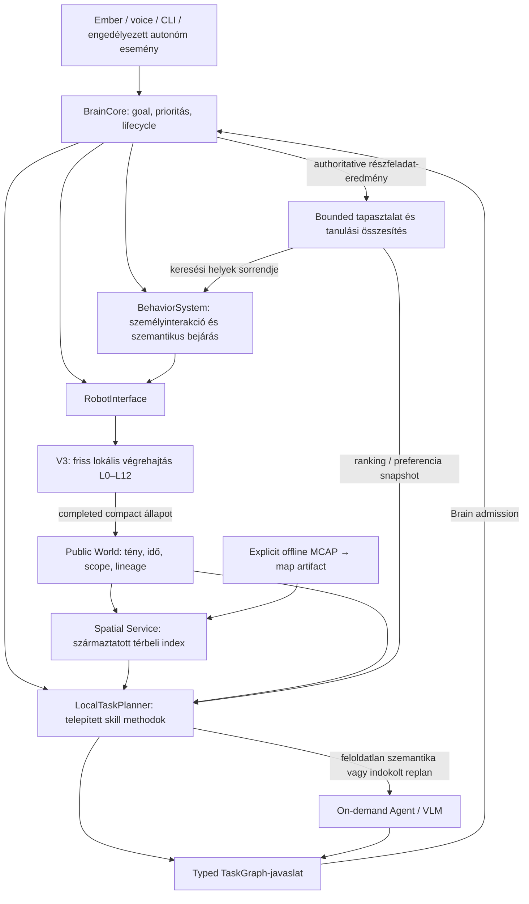

# R2B4 Local Cognitive Executive — architekturális lezáró refaktorterv

Dátum: 2026-10-08. Állapot: source-alapú terv, nem implementációs vagy hardveres készre jelentés.

**Következő fő fejlesztési cél — 2026-10-10:** [Nyitott Skill/Interface és dinamikus LCE–LLM viselkedésszintézis](LCE_LLM_COOPERATION_PLAN.md). A folytatás egységes, bővíthető robotfelületet, új feltételes/ciklikus viselkedési programok alkotását és javítását, valamint tartós, LLM nélkül végrehajtható skill-könyvtárat tervez. A jelen dokumentum korábbi, kezdetben adat- és választásmódosításra korlátozott tanulási fázisát ez az új fejlesztési cél bővíti; az eredeti baseline-t a 13. fejezet és az új source-alapú résfeltárás pontosítja.

A terv a meglévő V3 és felső host rendszer továbbfejlesztése. Első felhasználói prioritás: **személykeresés, követés és emberi interakció**. Térbeli kiindulópont: `tools/mcap50-to-map.py`. A Room Cruise és Follow Person felső szintre emelését a terv megvizsgálja és konkrét felelősségekre bontja.

Az authority továbbra is a [rendszerszintű működési contract](../R2B4_SYSTEM_BEHAVIOR_CONTRACT.md), a [production struktúra](../STRUKTURALIS_RETEGEK_V3.md) és az [async runtime contract](../ASZINKRON_RUNTIME_CONTRACT_V3.md). Ez a dokumentum megvalósítási terv; nem negyedik contract, és nem írja át az authoritykat. A korábban hivatkozott `top-logic-refaktor-plan.md` történeti előzmény, a jelenlegi working tree-ben nem érhető el; készültségi állítás csak a source ellenőrzéséből vehető át.

## 1. Architekturális döntés

**A meglévő BrainCore-t kell lezárni és tapasztalatból fejlődő executive-vé bővíteni.** A robot már rendelkezik célgazdával, lokális feladattervezővel, typed TaskGraph-felülettel, behavior végrehajtással, közös szemantikus memóriával és külön Spatial Service-szel. Új executive, párhuzamos világmodell vagy általános agent-framework létrehozása nem indokolt.

A kívánt fejlődés három összekapcsolt képesség:

1. **Megbízható végrehajtás:** pontos kérés → elfogadott terv → korrelált részfeladat-eredmények → bizonyított céllezárás vagy megmagyarázott hiba.
2. **Használható tartós tudás:** helyek, személyek, térképi referenciák és tapasztalatok megmaradnak; a történeti emlék és az aktuális végrehajthatóság külön minősítést kap.
3. **Korlátozott önálló tanulás:** a robot a saját igazolt eredményeiből javítja a keresési helyek és a telepített skill methodok sorrendjét, valamint explicit emberi tanításból bővíti a tudását. Minden fizikai végrehajtás a meglévő canonical határon marad.

Az első változatban a tanulás **adat- és választásmódosítás**, nem saját source generálása vagy a mozgásvezérlés online betanítása. Ettől még valódi öntanulás: a következő feladat döntése mérhetően függ az előző, hitelesített feladatok eredményétől, és ez restart után is megmarad.

## 2. Ellenőrzött adottságok és bővíthetőség

Az alábbi „bekötött” minősítés production source-ból következik. Nem jelenti, hogy az adott képesség élő hardveren ebben a munkában sikeresen lefutott.

| Terület | Meglévő állapot és source | Lezárandó rés |
| --- | --- | --- |
| Host composition | `robot_runtime.py:PublicRobotRuntime`, `serve`: egy Public World, Spatial Service, BehaviorSystem és BrainCore; külön host dispatcher | Az új képességeket ebbe kell bekötni; új semantic owner nem szükséges |
| Brain | `brain_core.py:BrainCore`: bounded goalok, prioritás, admission, generation-alapú cancellation, korrelált végrehajtás | Eredeti baseline: graph-egységesítés, runtime replan és tanuló választás. A graph-egységesítés és az első tanuló választás azóta elkészült (13. fejezet); futó goal replanje az új együttműködési terv feladata |
| TaskGraph | `task_graph.py`: bounded DAG, action/world-wait/branch/report, deadline, failure és retry feltételek | Egységes végrehajtási reprezentáció, explicit személy- és tanítási feltételek, ellenőrzött eredményhatások |
| Lokális planner | `local_task_planner.py:LocalTaskPlanner.resolve`, `_step`: deklarált HU/EN minták, konkrét összetett methodok, specialistafallback | A methodok jelentős része kódban hardcoded; nincs outcome-alapú methodrangsor |
| LLM/Agent | `conversation_service.py:_process`, `_specialist_decision`; `agent_core.py:AgentCore.run` | On-demand értelmezés/proposal bekötött; folyamatban lévő goalhoz kötött, bounded replan-kérés még külön fejlesztés |
| Behavior | `behavior_system.py:BehaviorSystem.register`, `_MissionProgram`; `search_person.py` | RoomCruise/Follow jelenleg nagyrészt mission-burok; a szemantikus hosszú távú policy ide emelhető |
| Személykeresés | `SearchAnyPerson`: bounded nézetváltás és track-acquisition; `SearchPerson`: ismert helyeken named fact keresése | Named person identity producer hiányzik; a JPEG lekérése nem állít elő személyazonosságot |
| Search → follow | `brain_core.py:_start`, `_behavior_result`, `test_brain_target_binding.py`: track/runtime/measurement binding | Névhez kötött friss track előállítása és explicit reacquisition-policy szükséges |
| Public World | `world_model.py:PublicWorldModel`, freshness/scope/query/restore; `SemanticProjector` production statusból és eredményekből tölt | A tartós tudás és a gyors robotállapot közös eviction-keretben van; nincs tanulási aggregáció |
| Spatial Service | `spatial_service.py:SpatialService`: tartós, származtatott hely- és entity-location index, explicit topológia | Bekötött globális atlasz-import és cross-session alignment nincs; a topológiai adatmodell önmagában nem topológiai tudás |
| Térképezés | `mcap50-to-map.py:build`: offline raw-LiDAR + L3 → stationary keyframe → ICP → SE(2) graph → occupancy | Az artifact frame/provenance lezárása, host referenciaként való betöltés és jelenidejű alignment külön feladat |
| Lokalizáció | `RobotEstimate`, `l3_state_estimation.py`: local/global pose, map-to-odom, transform revision; meglévő LiDAR matcher | In-session keyframe/relocalization van; külső tartós atlasz betöltése nem production képesség |
| Async V3 | `v3_process_runtime.py`, `v3_hardware_runtime.py`: process encoder/IMU/LiDAR/vision/planner, typed closure | Új atlasz/vision compute csak szűk typed edge-ként; CPU-, payload- és jitter-budget külön mérendő |
| Voice | `voice_service.py`, `conversation_interface.py`: külön mic owner, wake/session, Brain ingress, lokális TTS, STOP lane | A production STT Groq-alapú; a voice elérhetősége jelenleg hálózati felismeréstől is függ |
| Evidence | Host ObservationHub, Brain/Behavior/interface lineage, MCAP/EVI/native replay | Megfigyelési esemény nem helyettesíti az authoritative task resultot vagy a friss measurementet |

**Bővíthetőségi értékelés:** jók a meglévő fizikai és typed boundaryk, a közös world API és a Brain lifecycle. A nehézség nem egy hiányzó általános platform, hanem a képességek közötti konkrét lezárás: identity → világ-tény → skill precondition → végrehajtás → eredmény → tapasztalat → következő döntés.

A contractban megengedett delayed `MissionExecutionFeedback` jelenleg nem része a `TickInputs`-nak; `MissionManager.evaluate` command inputot kap. Ez nem előfeltétele a host executive lezárásának: a meglévő finite action és behavior result használható. Új L5 feedback csak konkrét, eddig nem teljesíthető mission-lifecycle igény esetén indokolt.

### 2.1 A kis AMR tényleges kerete

Read-only host ellenőrzés: Raspberry Pi 5 Model B Rev 1.0, `/proc/meminfo` szerint `MemTotal: 4147088 kB`, tehát körülbelül 4 GB-os gép. A Pi 5 négymagos platform; a [gyártói adatlap](https://datasheets.raspberrypi.com/rpi5/raspberry-pi-5-product-brief.pdf) a platform specifikációja, nem aktuális robot-benchmark.

Aktív konfigurációk: `conf/hardver.json`, `fizika.json`, `speed_map.json`, `vezerles.json`; egyetlen feloldó: `v3/config.py:ConfigResolver`.

- Differenciálhajtás, 0,3557 m nyomtáv, 0,46 × 0,38 m footprint; encoder + BNO055 + RPLIDAR_C1.
- Kamera: IMX708, kalibrált képút, 640 × 360 detector stream és 1280 × 720 main stream, konfigurált 16 FPS. Ez nem mért inference-frekvencia.
- Person detector: LiteRT/EfficientDet Lite0, egy inference-thread; a konfigurált modellfájl jelen van. NPU gyorsítás nincs bekötve a vizsgált konfigurációban.
- V3 control: 20 ms periódus, 50 Hz. Async L6 engedélyezett; új planner request release nagyságrendje 100 ms a jelenlegi config szerint.
- Lokális perception: legfeljebb 96 pont, 2,5 m; L4 local map: 0,1 m, 1200 cellás keret; structural memory: 4096 cella. Az offline mapper ennél részletesebb, nagyobb térbeli evidence-et fogyaszt.
- `runtime_affinity.enabled=false`: a jelenlegi baseline Linux scheduler-managed. A configban szereplő CPU-maszkokból nem következik aktív izoláció.
- Public host status/behavior poll: `serve` 0,2 s. Ez megfelelő szemantikus orchestration kiindulópont, de nem gyors személykövetési szabályozó.

A hasznos maximalizálás: a már megszerzett measurementből több tudás, jobb methodválasztás és kevesebb felesleges compute. Nagy lokális LLM vagy folyamatos atlaszoptimalizálás kapacitását ezek az adatok nem bizonyítják. Akkumulátor-, dokkolási és manipulációs képességre a vizsgált wiringból nem építhető tervbeli készültségi állítás.

## 3. A `mcap50-to-map.py` mint térbeli alap

### 3.1 Mi használható már most?

A tool teljes 50 Hz-es, finalizált MCAP-ot és raw LiDAR evidence-et követel. Stationary ablakokból settling/guard után több scant összevon, tartós visszatéréseket szűr, szomszédos keyframe-eket point-to-plane ICP-vel illeszt, nem szomszédos loopokat ellenőriz, majd robust least-squares SE(2) graphot optimalizál. Az occupancy 5 cm-es rács; a nem megfigyelt cellák megmaradnak ismeretlennek.

Közvetlen source pontok: `_extract_pose_samples` (261), `_extract_raw_scans` (307), `_stationary_windows` (395), `_fuse_window` (452), `_scan_edge` (630), `_build_edges` (675), `_optimize_graph` (771), `_render_occupancy` (837), `_write_outputs` (927), `build` (967).

A felhasználó megnyitott `v3_20261008_211523_5336_capture_global_map/report.json` artifactja **saját jelentése szerint** 706 használható scant, 3329 L3 pose sample-t, 8 keyframe-et, 7 ODOM + 7 SCAN + 1 LOOP élt tartalmaz. A jelentett térkép 182 × 112 cella; megfigyelt terület 20,5125 m², szabadnak minősített terület 18,31 m², optimizer status `OK`, strict loss számlálók nulla. Ezek meglévő, származtatott artifact-adatok; ebben a munkában nem történt új build, független integrity-verifikáció vagy exact replay.

Ez már használható geometriai referencia a helyek, keresési nézetpontok és későbbi térbeli tudás kialakításához. A connected graph, az optimizer sikere és az 5 cm-es rács nem igazol 5 cm-es globális helypontosságot, szobanevet, aktuális járhatóságot vagy személyazonosságot.

### 3.2 A legfontosabb frame-határ

`_normalize_seed_poses` az első keyframe seed pose-ához viszonyít, az optimizer pedig az első csomópontot rögzíti. Az optimalizált keyframe-ek egymáshoz képest is elmozdulhatnak: **az optimalizált atlasz és a teljes eredeti odometriai pálya kapcsolata nem feltétlenül egyetlen rigid transzformáció**.

Az NPZ elmenti a rácsot, normalized seed/optimized pose-okat, origint és resolutiont. Nem menti el a fused `cloud_local` keyframe-felhőket. A jelenlegi CSV/report nem ad teljes eredeti anchor-, source frame-, runtime/session-, clock-epoch- és extrinsic provenance-t. A reportban szereplő source commit konstans önmagában nem az aktuális tool/config azonosításának bizonyítéka.

Következmény: `opt_x/opt_y` nem küldhető közvetlenül `R2B4_BOOT_ROBOT_MAP` célként. Ugyanazon frame-név vagy ugyanaz a capture-könyvtár nem jelent jelenidejű alignmentet.

### 3.3 A szűk integráció terve

**Offline oldal:** a tool marad explicit developer művelet. A későbbi export egészítse ki a meglévő artifactot verziózott map identityval, input hash-sel, tényleges tool/config identityval, eredeti keyframe anchorral, frame/epoch/generation és measurement/scan/tick hivatkozásokkal, extrinsic/calibration identityval és a használt numerikus opciókkal. Ha a meglévő matcherhez szükséges, külön bounded keyframe-cloud asset is exportálható. Korábbi capture/map outputot nem írunk át; régi artifact történeti geometriaként olvasható.

**Host oldal:** egy konkrét atlasz-betöltő adapter a Spatial Service mögött tartson asset-hivatkozást és bounded származtatott hely/viewpoint indexet. A név, személy, tárgy és explicit kapcsolatok tény-ownerje továbbra is a Public World. A teljes rács és NPZ nem kerül a Public World snapshotba, tool JSON-ba vagy V3 statusba. A gépi szobaszeparálás legfeljebb hipotézis; explicit emberi naming vagy külön perception-evidence teszi szemantikus hellyé.

**Jelenidejű használat:** szükséges egy bizonyított `atlasz ↔ aktuális local/global frame` kapcsolat. Elsőként a meglévő localization/matcher edge-hez adjunk szűk reference-map adaptert és typed matching-resultot; a Spatial Service nem futtat második localization-ownert. A matching result tartalmazzon map identity/revisiont, source measurement/sequence-et, runtime/session/generationt, transform identityt, residual/ambiguity minősítést és lejárati feltételt. Ha döntési inputként kell, a meglévő localization input closure-n keresztül kerülhet L3 elé.

A Spatial Service csak az authoritative completed localization alapján minősítheti a térképi helyből feloldott aktuális célpontot. Több jó illeszkedés, rossz observability, elavult measurement vagy frame-váltás esetén a név és az emlék megmarad, a koordináta nem lesz végrehajtható. A végső local geometry és útvonalmegvalósíthatóság továbbra is L4/L6 feladata.

Az atlasz saját frame/identity marad; a meglévő `R2B4_BOOT_ROBOT_MAP`, `R2B4_ODOM_LOCAL`, `map_to_odom` és `transform_revision` jelentését nem nevezzük át. Az atlaszhoz mért, elfogadott frame-kapcsolatot a localization boundarynak külön, completed typed értékként kell publikálnia. A host ezt használja a helycél valamelyik már elfogadott runtime command-frame-be konvertálására. Ha a meglévő absolute-pose inputot használjuk, az oda küldött érték előbb a deklarált L3 frame-be legyen transzformálva; atlasz-koordináta nem címkézhető át boot-map pose-zá. Az elfogadott observationt a megfelelő atlasz-revisionnel és külön transform-lineage-dzsel is korrelálni kell; önmagában az L3 acceptance nem bizonyít atlasz-alignmentet.

Az online tanulás nem függhet folyamatos `c 50` capture-től vagy automatikus EVI/replay futástól. A bejárásból jövő online tudás a meglévő completed L3/L4 producer-oldali, bounded observation útjából épüljön. A raw scan, ICP, pose-graph optimalizálás és teljes occupancy compute a control interpreteren kívül maradjon.

**Két külön térbeli kapcsolat:** a geometriai pose-graph LOOP scan-illesztést jelent; a „nappali → folyosó” topológiai él külön szemantikus/traversal evidence-et igényel. A mapper graphját nem szabad szobák közötti járhatósági graphként átnevezni.

## 4. A Local Cognitive Executive célfelépítése

A tanulási összesítés a közös host memória része, nem új goal-owner. A diagram completed-adat- és intentirányokat mutat; nem vezet be új V3 production réteget vagy observation-visszaélt.

### 4.1 Egy belső végrehajtási reprezentáció

A legacy `steps` bemenetet az admission határán fordítsuk TaskGraph-fá. A Brain belül egyetlen node/lifecycle/condition/failure/deadline útvonalon dolgozzon. Az explicit mozgáskérés szemantikáját ellenőrző `_plan` validációt meg kell őrizni vagy ugyanabba az admissionbe átvinni; az egyszerűsítés nem gyengítheti az irány-, távolság-, időtartam- és sorrendellenőrzést.

Ez célzott `brain_core.py` / `task_graph.py` refaktor, nem új scheduler. Az action dispatch, STOP generation-fence, pontos target binding és deadline-kezelés korábbi megfigyelhető viselkedése megmarad. A graph expected effect állítása csak ellenőrzendő feltétel: sikeres admission után sem válik world factté.

### 4.2 A telepített skillek konkrét bővítési pontja

Jelenleg a behavior-regisztráció, `ACTION_CATALOG`, Brain paramétervalidáció, public runtime `ACTIONS`/name routing és planner methodok több ponton tartalmaznak statikus felsorolást. Egy új behavior puszta `register()` hívása nem teszi azt publikusan tervezhetővé.

A lezárás: egy kicsi, kódban telepített **person/interaction skill descriptor** készlet, amelyből a host behavior capability és lokális method-regisztráció származik. V3 canonical primitive descriptorai a meglévő action katalógusban maradnak. Nem szükséges dinamikus plugin-loader vagy általános registry-framework.

Egy method csak a valóban szükséges adatot deklarálja: skill/method identity és verzió, paraméterséma, szükséges capability, előfeltételek, ellenőrizhető eredményfeltételek, bounded graph factory, duration/step/retry keret, target-binding igény és explicit engedélyezett választási preferenciák. Első methodok: anonymous acquisition, named search, bound follow, person-teaching, identity clarification, last-seen place search és human goal feedback.

### 4.3 Eseményvezérelt ébresztés és bounded replan

A Brain `notify` és saját dispatch eventje már létezik; world/behavior változás már ébreszt. Ezt kell tovább használni. A 0,2 s statuspoll maradhat watchdog/freshness alap; csak mért késleltetés indokol sűrítést. Nem kell új eventbus vagy általános időzítő.

Replan-kérés csak az aktív goal identityjához, generationjéhez, megőrzött user constraintjeihez és az authoritative részfeladat-eredményhez kötve készülhet. Példák: releváns új személy/hely evidence; dokumentáltan kimerült lokális search method; szemantikus többértelműség. Előbb lokális alternatíva, csak utána on-demand specialist.

A specialistajavaslat visszatérésekor új admission szükséges. STOP/preemption/restart után érkező régi javaslat eldobandó. A már teljesült részfeladatok nem indulnak újra providerfallback vagy replan miatt. Safety-, stale-, crash- vagy identity-hiba után nincs automatikus motion-retry; a kért cél megmaradhat magyarázatra, a fizikai folytatás külön friss feltételeket igényel.

A jelenlegi vision kliens aktív demand hibája után nem kapcsolódik csendben újra (`process_vision_port.py`). A felső policy capability-unavailable eredményt kezeljen; későbbi folytatás release/new-demand és új, minősített session/measurement szerint történhet, korábbi track automatikus újrahasználata nélkül.

## 5. Első cél: személykeresés, követés és interakció

### 5.1 Stabil személy és pillanatnyi track

Két külön adat kell a közös Public Worldben:

- **Tartós személy:** stabil entity ID, ember által tanított név/alias és preferenciák, a tanítás eredeti forrása és ideje.
- **Aktuális binding:** a stabil entity és egy adott V3 track kapcsolata, runtime/session/vision-generation, eredeti measurement, world revision és lejáró bizonyíték.

Első producer legyen explicit emberi tanítás a canonical host interfészen: például „ezt a személyt nevezd Annának”. Pontosan egy, friss és a felhasználó által egyértelműen kiválasztott track esetén köthető össze. Több személy, stale kép vagy runtime-váltás esetén tisztázás szükséges. A „beszélő = látható személy” azonosság nem feltételezhető; ehhez nincs ellenőrzött multimodális speaker identity pipeline.

A tanítás az aktuális társítást igazolja; önmagában nem jelent későbbi automatikus vizuális névfelismerést. Restart vagy track-vesztés után a név emlék, az új track újból igazolandó. Későbbi visual re-identification csak külön vision-edge képességként, minősített és lehetőleg emberileg megerősített hipotézissel kerülhet ide. A jelenlegi person detector általános embert detektál; az IMX708 alacsony elhelyezése és a képtartalom miatt külön mérés kell annak eldöntésére is, milyen azonosító megfigyelés lehetséges.

### 5.2 A keresés valódi lezárása

`SearchPerson` jelenleg egy külső named `person_position` factre vár, miközben `SemanticProjector` anonim `person:{runtime}:{track}` tényeket állít elő. A named producer bekötése ezért elsődleges. Ha a keresés helyhez kötött, de track nélküli named factet talál, az **információs találat** lehet; ettől még nem igazolt egy fizikailag követhető személy.

Az eredményt érdemes két explicit állításra bontani: a keresett személyről van friss semantic evidence; illetve van ugyanahhoz a személyhez friss, geometriailag használható, runtime-bound track. A „keresd meg és kövesd” graph csak a második feltétellel léphet Follow-ra. Az elfogadott terv, a sikeres keresés és a teljes követési cél eredménye továbbra is külön marad.

Első user scenario:

1. A robot emberi tanítással létrehoz egy stabil személyt és egy friss track-bindingot.
2. A későbbi kérés megőrzi a személyt, időtartamot és minden explicit feltételt.
3. A host rangsorolja az ismert, aktuálisan feloldható keresési helyeket; a V3 dönti el a navigálhatóságot.
4. A robot megfelelő nézetpontból megfigyel, szükség esetén identity-tisztázást kér.
5. Friss bound target mellett indul a követés; target-vesztéskor a lokális végrehajtás biztonságosan HOLD/SEARCH/STOP állapotot ad.
6. A cél lezárása a tényleges követési execution és kért idő alapján történik. A keresés sikere külön megmarad, ha a követés később hibázik.
7. A host közli az eredményt, megőrzi a keresési/követési tapasztalatot, és a következő hasonló kérésnél felhasználja azt.

### 5.3 Az interakció konkrét fejlesztése

Az identity-tisztázás és tanítás legyen ugyanahhoz a goalhoz kötött, bounded beszélgetési állapot. Információs közbekérdezés nem váltja le a futó fizikai célt; új inkompatibilis mozgáskérés explicit preemptiont jelent. A „találtam valakit”, „Annát azonosítottam”, „követem”, „elvesztettem”, „befejeztem” szöveg a megfelelő korrelált állításból származzon.

Ha interakciókor egy konkrét ember felé kell fordulni, a `FACE_PERSON` canonical paraméterezéshez target/runtime binding szükséges. Ez jelenleg a Follow actionnél megvan, a FACE_PERSON katalógusánál nincs. Szűk action/mission extensiont tervezzünk; host yaw- vagy motorvezérlő ne készüljön.

Voice-localitás: a meglévő Groq STT miatt a wake és a spoken STOP felismerése is hálózati elérhetőségtől függhet. A következő lokális bővítés egy kis wake/STOP recognizer lehet a meglévő egyetlen mic owner frame-portján, külön compute útban, mérhető false-positive/false-negative és latency evidence-del. A teljes általános offline STT csak mért CPU/memória-keret mellett indokolt. A typed/CLI STOP és V3 fail-safe maradjon önállóan működő canonical út.

## 6. Mit emeljünk ki Room Cruise és Follow Person esetén?

**Igen, a magasabb viselkedési döntések kiemelése indokolt.** A teljes gyors lokális mozgáslogika áthelyezése jelenleg nem indokolt. Ez a döntés a meglévő contractokon belül megvalósítható; az esetleges L6 target-state ownership későbbi átrendezése külön contract+source változtatás lenne.

| Behavior | Host Brain / BehaviorSystem felelősség | V3-ban maradó fizikai felelősség |
| --- | --- | --- |
| Room Cruise | Melyik ismert hely/régió következzen; megfigyelési cél; visszatérés; bejárási időkeret; emberi megszakítás; tanult revisit/ranking és karakterpreferencia | Local costmap, coverage/progress, short-horizon célmintázás, rollout, obstacle/footprint, lokális escape, continuity és realizálható sebesség |
| Follow Person | Kit követünk és miért; név/track binding; felhasználói időtartam; társas preferencia; semantic lost-person search; szükséges újraazonosítás; céllezárás | Friss target projection/retention, bounded prediction, távolságtartás/fékezés, irányba fordulás, collision feasibility, lokális occlusion HOLD/SEARCH és safety |

Room Cruise esetén a host egy ismert place/viewpoint sorozatot komponálhat canonical NAVIGATE-tal, illetve nyitott régióban használhatja az EXPLORE primitívet. Ismeretlen helynevet vagy topológiát nem állíthat elő pusztán coverage countból. A globális bejárási cél és a lokális friss coverage két külön szint.

Follow esetén ismételt host NAVIGATE parancsokkal nem helyettesítjük a folytonos követést: a 0,2 s poll, missionváltások és objective/cache resetek elveszíthetik a gyors target-korrekciót. A host semantic keresése és az L6 rövid occlusion-search egymás után, explicit handoffal fusson. Ha később a host minden keresési irányt birtokol, opt-in typed `loss-policy=HOLD` jellegű szűk extension kell; ugyanazt a search ciklust két owner nem vezérelheti.

A tanult társas követési preferencia csak a canonical felületen deklarált tartományból választható. A jelenlegi paramétersémán nem elérhető stand-off módosítást nem lehet configírással megkerülni; ez külön, validált intent-parameter fejlesztés lenne.

## 7. Tartós memória és az öntanulás első megvalósítása

### 7.1 A memória megőrzési szabálya

`PublicWorldModel` jelenlegi alapkerete 256 fact / 192 KiB; a gyors robotállapot és tartós entity/preference ugyanabba az eviction-keretbe kerülhet. A persistence önmagában nem garantál tartós tudást, ha a fact már a snapshot előtt kiesett.

A meglévő owneren belül kell külön bounded megőrzési keret a gyors állapotnak, a tanított tartós tényeknek és a feladattapasztalatnak. Ez nem három világmodell: ugyanaz a query/fact/revision/freshness/scope API. A határok és a telítettség láthatóak; nincs végtelen history vagy „minden legyen örökre pinned” policy. A nagy map asset és opcionális kép továbbra is referencia, nem inline world value.

A Spatial Service jelenlegi 128 fact / 192 KiB származtatott indexében ugyanezt a hely- és geometriai-minta versenyt kezelni kell. A host state alapmentése 5 másodperces; explicit `world.observe` force-save-t kér. A tanítás és tanulási update durability-jét külön meg kell határozni: in-memory elfogadás nem ígérhet azonnali crash-biztos megőrzést. Mentési hiba capability/knowledge eredményként látszódjon, és ne tartsa a STOP-hoz szükséges lockot.

A tanított név restart után megmaradhat; a korábbi aktuális koordináta és person-binding lejár. A bounded task historyvesztés és restore eredeti source provenance-e megmarad. Schema-migráció csak a meglévő canonical host state kompatibilis olvasásával, adatvesztés és régi aktív goal automatikus folytatása nélkül történjen.

### 7.2 Mire tanuljon először?

| Tanulandó tudás | Authoritative forrás | Mire használható? |
| --- | --- | --- |
| Személy neve/aliasa | Explicit emberi tanítás, trackhez kötött observation | Referensfeloldás; aktuális motionhoz új binding kell |
| Személy–hely keresési prior | Korrelált keresési próbák, bizonyított személytalálatok, releváns observation minősége | Meglévő keresési helyek sorrendje |
| Skill method sikeresség/költség | Brain részfeladat-result, methodverzió, execution duration, typed failure | Előfeltételeiket teljesítő telepített methodok választása |
| Emberi interakció preferenciája | Explicit javítás vagy visszajelzés | Megszólítás, kommunikációs forma, engedélyezett behavior-preferencia |
| Topológiai tapasztalat | Helyek közötti korrelált, frame-qualified sikeres traversal | Host itinerary prior; jelenidejű út/safety továbbra is V3 |

Az első online algoritmushoz elegendő bounded számlálás és erősen regularizált aránybecslés. Például method sikerprior `p=(success+α)/(qualified_trials+α+β)`, pozitív α/β alappriorral. Determinisztikus tie-break és a deklarált hely/method sorrend fallbackként megmarad. Az idő/költségbecslés bounded mozgó összesítés lehet. Nagy neurális modell nem szükséges ezekhez az első döntésekhez.

**Fontos mérési különbség:** „nem találtam a kért személyt” csak akkor qualified negatív keresési próba, ha a megfigyelési feltételek és az identity-ellenőrzés ténylegesen rendelkezésre álltak. Kamera-/detector-/identity-unavailability, NO_PATH, safety STOP, megszakítás és hiányos evidence külön okok. Ezekből nem tanulható, hogy a személy nincs az adott helyen. A prior a megfigyelt keresési feladatokra érvényes; nem objektív személy-jelenlét valószínűség. A soha nem látogatott helyek bizonytalansága külön megmarad.

Kezdetben személy × hely, illetve method × kevés minősített context összesítés elegendő. Új kontextusdimenzió csak akkor kell, ha a gyűjtött eredmények megmutatják az előnyét; kora reggel/este, hely vagy target-visibility keresztszorzatának mechanikus felépítése kevés adatnál értelmetlen. Az exploration csak az adott user goal engedélyezett alternatíváin belüli választás; nem indít önálló fizikai tanulófutást.

### 7.3 A feedback hurok lezárása

Minden tanulási rekord a már meglévő goal/subtask/method/behavior/command/mission identityra és eredeti mérési lineage-ra hivatkozzon. A task result megkülönbözteti a kért, megkezdett, ténylegesen végrehajtott és még hátralévő részt, a completion minősítését, typed failuret, identity és frame scope-ot. Az emberi elégedettség külön mező, nem írja felül a fizikai completiont.

A tanulási összesítés authoritative Brain/Behavior resultból épül, külön bounded host munkaként. Az ObservationHub/journal/MCAP marad passzív bizonyíték. Consumer crash vagy evidence-drop esetén a robot végrehajtása folytatható az eredeti szabályok szerint; hiányos learner-inputból nincs új frissítési állítás. Ismételt polling/journal event nem duplázza a tanulási mintát.

A planner egy immutable, verziózott tanulási snapshotot olvasjon a tervezési döntéshez. Ezt a választás identityjához kössük; a graph végrehajtása nem változik alatta egy új háttérfrissítés miatt. A döntés reprodukálhatóságához a methodverzió, relevant world revision és tanulási snapshot azonosítója elég; teljes history vagy nagy memory graph nem kerül V3 inputba.

Kezdetben a rendszer az alapmethodot választja. A tanult sorrend csak megfelelő számú, qualified mintánál és deklarált javulási feltétellel lép életbe. Sérült, elavult vagy adott methodverzióhoz nem illeszkedő összesítésnél az alapprior és determinisztikus sorrend működik. Automatikus source/config módosítás, generált behavior aktiválás vagy safety-küszöb tanítása nem része ennek a runtime önfejlesztésnek.

A tanulás és a safety szétválasztása illeszkedik a [Safe Learning in Robotics](https://arxiv.org/abs/2108.06266) által tárgyalt problémához; a konkrét bounded-ranking megoldás itt repository-adottságokból választott tervezési javaslat, nem a cikk által bizonyított R2B4 garancia. A hierarchikus methodokhoz a [HDDL eredeti leírása](https://arxiv.org/abs/1911.05499) ad fogalmi hátteret; HDDL parser vagy új planner dependency bevezetését ez a terv nem igényli.

## 8. Compute és késleltetési terv

A control budget 20 ms; tényleges szabad kapacitást ebben a munkában nem mértünk. Az első benchmarknak külön kell mérnie a fizikai I/O késését, a Python munkát/GIL-t, az IPC payloadot/serializálást, scheduler/CPU contentiont és magát az L0–L12 futást.

| Munka | Tervezett hely és trigger | Control felé átadott érték |
| --- | --- | --- |
| Goal/admission/TaskGraph | Meglévő host Brain; request vagy releváns esemény | Canonical intent |
| Search-place/method ranking | Bounded host számítás; új tervnél | Cél/method/preferencia, nem history |
| Tanulási összesítés | Host background; completed qualified outcome | Plannernek kis immutable snapshot; V3-nak nincs learner payload |
| Kamerakép/inference/re-identification | Meglévő demand-driven vision owner; konkrét igény | Kompakt minősített track/detection/binding evidence |
| Atlasz/reference matching | Meglévő localization compute edge bővítése; explicit map igény | Typed localization result, source és quality lineage |
| Offline teljes térkép | Explicit developer tool, motor nélkül | Verziózott artifact, nincs live actuation input |

Atlasz matching és vision compute induló policyja legyen bounded és demand-driven. Kevésbé sürgős tanulási/mapping munka halasztható; alapkövetés és STOP nem vár rá. Egy nagy inference munka indulási korlátját csak közös terhelésmérés után rögzítsük. A processz és affinity önmagában nem időzítési garancia.

Meglévő mérendő payloadok: L6 planner request `RobotEstimate + WorldSnapshot + coverage`, process queue serialization; 50 Hz sensor-debug capture `ExecutionRecord`; compact status mailbox. A felső memória vagy teljes atlasz hozzáadása ezekhez nem indokolt. Új processz csak konkrét compute/ownership izoláció miatt kell; egyszerű bounded számlálóhoz nem.

## 9. Megvalósítási sorrend és lezárási kapuk

Az alábbi egységek önállóan reviewzható változtatások. A szükséges meglévő kódot megtartják; a következő lépés csak az előző konkrét kapujának teljesülése után válik aktív production képességgé. Nap/hét becsléshez előbb a hiányzó runtime és recognition baseline szükséges.

| Sorrend | Konkrét változtatás és fő fájlok | Lezárási feltétel |
| --- | --- | --- |
| 0. Baseline | Search/follow capability, failure taxonomy, capture-scope és timing mérési terv; meglévő native eszközök | Az első hibás boundary és érték megkülönböztethető; ismert vs nem bizonyított készültség rögzített |
| 1. Memória | `world_model.py`, `robot_runtime.py`, `semantic_projector.py`: külön bounded retention és qualified outcome | Gyors pose/mission churn nem törli a tanított személy/hely/preference tudást; restore nem frissíti a measurementet és nem indít motiont |
| 2. Person identity MVP | Typed human teaching/binding a host canonical felületen; `search_person.py`, `brain_core.py`, HRI | Névhez friss track bizonyíthatóan kapcsolható; többértelmű/stale/restart eset fail-closed; search→follow ugyanaz a személy |
| 3. Graph és skillek lezárása | `task_graph.py`, `brain_core.py`, `local_task_planner.py`, konkrét host descriptorok | Legacy és graph bemenet azonos feltételekkel/eredménnyel egyetlen executorban; explicit constraint nem vész el |
| 4. Személyinterakció policy | `behavior_system.py`, `search_person.py`, HRI; szükség szerint bound FACE_PERSON action | Acquire/clarify/search/follow/lost/report lánc bounded, preemptelhető; lokális és szemantikus search handoff egyértelmű |
| 5. Első tanuló választás | Host outcome összesítés, Public World queries, planner/search ranking | Qualified resultból egyszeri update; restart után ugyanaz az összesítés; következő feladat sorrendje javulhat, user constraint/safety változatlan |
| 6a. Térképi referencia | `mcap50-to-map.py` export metadata; Spatial Service atlasz adapter és explicit place/viewpoint teaching | Assetből helyemlék olvasható; source gauge/provenance megmarad; régi map nem current pose |
| 6b. Aktuális alignment | Meglévő lidar matcher/localization edge, typed result/closure, Spatial célfeloldás | Friss, atlasz- és transform-lineage-hez kötött alignment → canonical cél; boot-frame eredet megmarad; ambiguity/stale/PID/generation-váltás visszavonja a célkonverziót |
| 7. Tanuló globális bejárás | Host RoomCruise place/viewpoint itinerary, eredmény-visszacsatolás | A bejárás keresési tudást növel; magasabb prioritás megszakítja; V3 lokális mozgása nem darabolódik host újraparancsolástól |
| 8. Cognitive replan és offline voice | Külön, egymástól független változtatások a meglévő specialist/mic portokon | Régi proposal nem éled STOP után; hálózat nélküli wake/STOP mérhetően működik, control jitter nem romlik |

A 6a offline artifact-lezárás az 1–2. lépéssel párhuzamosan is fejleszthető, mert nem módosítja a fizikai authorityt. A 6b nagyobb canonical boundary változás; erre külön release/replay/timing gate kell. Az első person MVP és tanuló keresési rangsor működhet még atlasz-import nélkül, a meglévő frissen minősített place-adatokkal.

Nem célszerű a teljes V3 L6 bontásával kezdeni. A legnagyobb első hozam a named identity producer, a megőrzött közös memória és a qualified feedback; ezek hiányát egy új motion architektúra nem oldaná meg.

## 10. Validáció és a fejlődés mérhetősége

A [pytest policy](PYTEST_POLICY.md) szerint a normál edit gate `./r test`; a célzott pack evidence az érintett változtatáshoz választandó. Canonical execution/closure/composition/config/motor boundary változásnál `./r test release`. Új teszt nem lesz automatikusan permanent gate-entry.

Meglévő célzott alapok: `test_brain_core.py`, `test_brain_task_graph.py`, `test_brain_task_graph_admission.py`, `test_local_task_planner.py`, `test_local_task_execution.py`, `test_brain_target_binding.py`, `test_search_person.py`, `test_behavior_system.py`, `test_brain_world_memory.py`, `test_spatial_service.py`, `test_temporal_host_boundaries.py`, `test_voice_orchestration_p0.py`; geometry/localization/process változásnál a kapcsolódó person-projection, dual-frame és process packok. Ezek tesztelési kiindulópontok, nem a production wiring helyettesítői.

**Lényegi új bizonyítékok:**

- Tanított identity és hely megmarad bounded állapotchurn és restart után; régi binding/location nem lesz current.
- Named és anonymous személy nem keveredik; runtime/generation/track váltás nem cseréli le csendben a követett embert.
- A graph expected effect nem válik megfigyelés nélkül factté; acceptance, mission completion és user-goal completion külön igazolható.
- STOP közben finite dispatch/replan/learning/storage sem indíthat régi actiont; learner vagy journal hibája nem blokkol STOP-ot.
- Keresési negatív minta csak qualified observation; unavailable, megszakított és NO_PATH eset külön marad.
- Dupla publication/poll/repeated result nem dupláz mintát; eltérő outcome ugyanazon identity alatt nem csendes felülírás.
- Map export/import megőrzi a frame/gauge/measurement lineage-t; unknown cell nem free, scan-loop nem semantic topology.
- Atlasz/localization edge direct és process út szemantikailag egyezik; stale/crash/error, supersede és source sequence/revision bizonyított; nagy raw payload nem jut a control critical pathba.

**Mérőszámok:** teljes user-goal sikerarány, korrelált search-success és follow-success külön, téves név/track bind, kért és tényleges követési idő, reacquisition szükségessége és időtartama, human clarification darabszám, keresett helyek száma és qualified keresési idő, LLM-hívás/task, end-to-end voice/STOP latency, host event-to-dispatch késés, process payload byte/CPU, control p50/p95/p99/max és deadline miss, RSS/CPU/thermal pressure.

A téves binding, stale-ból engedett motion és STOP utáni action-revival elfogadási száma nulla. A teljesítményküszöböket a meglévő robot mért baseline-jából kell rögzíteni; itt nem állítunk elő kitalált success-rate vagy latency garanciát. Az új compute ugyanazon input/load/config mellett nem ronthatja a releváns control budgetet.

A tanulás bizonyításához az alap és tanult policyt azonos feladatfeltételeken kell összevetni, a tanulásra felhasznált és értékelési próbákat külön tartva. Az első sikerhez elég a keresési sorrend/költség javulása megfelelő qualified próbákon, az identity és safety invariánsok sérülése nélkül. A kevés adatból kapott prior önmagában nem általánosítható robotképesség.

V3 decision-input változásnál teljes, integritásellenőrzött 50 Hz capture, explicit MCAP Evidence Compiler és native Replayer szükséges; csak tényleges `MATCH` teljesíti a replay gate-et. A motor nélkül futó replay az execution determinizmusát igazolja, nem azt, hogyan változna a valódi világ egy másik tanult policy alatt. Host döntésekhez a megőrzött world/method/learning snapshot és eredménylánc rekonstrukciója szükséges. Pontos replayt az 1/5/10 Hz compact capture nem bizonyít.

Élő acceptance később, külön kifejezett mozgásengedéllyel: több személy és occlusion; kamera-/hálózatkiesés; named acquisition és follow; STOP/preemption; helytanítás; restart utáni emlék/alignment; tanult keresési sorrend; párhuzamos vision/capture/atlasz terhelés. Váratlan safety/health/fault/process/timing eredmény után nincs automatikus újrafuttatás.

## 11. Mi tekinthető architekturálisan lezártnak?

A lezárás nem azt jelenti, hogy minden jövőbeli skill kész. Akkor teljesül, ha egy új, konkrét skill a telepített descriptor/method, meglévő TaskGraph, közös world fact és RobotInterface út kiegészítésével bevezethető; nem kell hozzá új célgazda, külön memória vagy L6 downstream injection.

A robot tudása, tervválasztása és feladateredménye ugyanazon identity- és időmodellben rekonstruálható. A tartós tudás visszatöltődik, a friss fizikai authority újra igazolódik. A tanulás a feladatválasztást javítja és megmagyarázható, a V3 determinisztikus végrehajtása pedig önállóan biztonságos marad a host tudás és specialisták hibája mellett is.

Nyitott, konkrét bizonyítandó kérdések: név szerinti identity producer minősége; vizuális reacquisition lehetősége ezen a kameraelhelyezésen; tartós atlasz illeszthetősége új runtime-ban; kevés mintás keresési tanulás haszna; 4 GB-os Pi együttes vision/planner/atlasz/voice terhelése. A korábbi tervben említett encoder watchdog és L3 bootstrap problémák jelenlegi fennállását vagy javítottságát ez az architektúraelemzés nem bizonyítja; ha reprodukálódnak, a legelső hibás tickhez és értékhez kell visszamenni.

## 12. Ennek a tervezési munkának a bizonyítékhatára

Source és aktív config elemzés, read-only hardware-identification, valamint a felhasználó által hivatkozott meglévő map-report/keyframe/graph részleteinek ellenőrzése történt. Runtime-, capture- és logadatot nem módosítottam, új térképet nem építettem, motort nem indítottam. A production source és authority-contractok ebben a munkában változatlanok.

Validáció: `./r test` — **14 passed**, exit 0; `git diff --check` — sikeres. Ez a meglévő kis robot-contract gate eredménye, nem a még meg nem valósított terv acceptance-e. Új MCAP compilation, native replay, providerhívás, felismerési benchmark vagy live robot evidence nem keletkezett; az itt leírt tanuló executive és atlasz-integráció megvalósítása a fenti ütemezett munkák feladata.

## 13. Megvalósítási állapot — 2026-10-09

Az előző fejezet az eredeti tervezési munka bizonyítékhatára. Az ezt követő implementáció a meglévő host ownerekben készült; az alábbi állapot szoftveres evidence, nem élő robot-acceptance.

| Szakasz | Implementált működés | Bizonyítékhatár |
| --- | --- | --- |
| 1. Memória | Külön bounded transient/knowledge/experience retention; tartós személy-, hely- és tapasztalati tudás; atomikus mentés | A restore megőrzi az eredeti időt és lineage-t; fizikai binding/location friss authorityja nem áll helyre |
| 2. Person identity MVP | Explicit HUMAN névtanítás; stabil entity és lejáró track-binding; runtime/frame/localization/camera-owner source-igazolás; named search → ugyanazon binding validálása → canonical follow | Több személy, stale adat, hiányzó owner-start proof és sessionváltás elutasítva; arcazonosítás és automatikus újraazonosítás nincs bizonyítva |
| 3. Graph és skillek | Legacy bemenet admissionkor TaskGraph lesz; egy belső graph-reprezentáció; megőrzött explicit mozgási feltételek; korrelált subtask result; telepített person descriptorok | A terv és expected effect nem world fact; a fizikai végrehajtás authorityja továbbra is a canonical V3 út |
| 4. Személyinterakció | Aktív fizikai cél melletti bounded névtanítás; pontos tanítási/clarification/mentési HRI; STOP és generation fence | A teljes reacquisition és hosszú távú interakció-policy későbbi gate; a tanítás a meglévő host dispatcherre várhat |
| 5. Első tanuló választás | Authoritative Brain subtaskokból bounded outcome-összesítés; qualified keresési minták; egyszeri update a megőrzött dedup-horizonton; immutable learning snapshot; implicit keresési helyek prior szerinti sorrendje | Explicit helylista sorrendje változatlan; method-statisztika és ranking olvasható, új methodot/source-ot nem generál; élő sikerarány-javulás nincs mérve |
| 6a. Térképi referencia | Verziózott mapper export eredeti gauge és measurement/scan/tick lineage-dzsel; explicit hash-ellenőrzött import; bounded atlasz/viewpoint index és emberi helytanítás | Az atlasz történeti referencia; nincs jelenidejű alignment, koordináta-átcímkézés vagy atlaszból származó motion authority |

Az observer/capture/EVI út is ellenőrzött: valós host teaching/search/Brain/learning események kerülnek az ObservationHub/journal → direct és process MCAP → explicit EVI compile/verify/query útra a célzott végponttól végpontig tesztben. Az új goal/node/method/version/world/learning és execution lineage megmarad; capture-drop/integrity hiba nem lesz sikeres bizonyítékká. A passzív observer nem learner input és nem completion-authority.

Az `r commands --json`, a publikus `read`/`execute` parancsok és a TAB-kiegészítés megjelenítik az új host képességeket. Az EVI `query`/`verify` kiegészítés az adott művelet tényleges parserét követi. A használható evidence-parancsokat a [publikus robot API leírása](PUBLIC_ROBOT_SYSTEM.md#tartós-tudás-és-tanulási-evidence) tartalmazza.

Validáció: `./r test` — **14 passed**; `./r test release` — **23 passed**. A release szintetikus 50 Hz-es LiDAR/RoomCruise scenarioja tényleges native replay **MATCH** eredményt követel és kapott. Célzott fejlesztői evidence: learner/world **63 passed**; identity/executive/HRI **102 passed**, az utolsó interjection/failure/feedback változtatásra **29 passed** és egy külön pre-execute fence teszt; atlasz/local planner **53 passed**; a végső atlasz + személy-executive + capture/EVI futás **25 passed**. Ezek egymással részben átfedő tesztcsomagok, nem összeadandó darabszámok. `r commands --json`, `r evi --help` és `git diff --check` sikeres.

A 0. szakasz source- és failure-boundary baseline-ja rendelkezésre áll, hardveres recognition/timing baseline még nem készült. A 6b friss atlasz-alignment, a 7. szemantikus globális bejárás és a 8. bounded cognitive replan/offline voice külön lezárási kapu marad. Nem aktív production képességek. A következő canonical localization/decision-input változtatáshoz release, integrity-ellenőrzött 50 Hz capture, explicit EVI compilation, native replay `MATCH` és timing evidence szükséges.

Ebben az implementációs munkában fizikai mozgás, live acceptance és meglévő capture exact replay nem indult. A szintetikus capture/EVI teszt a bizonyítékút működését igazolja; önmagában nem igazol felismerési minőséget, tanult policy előnyét, control-jittert vagy atlasz-alignmentet. Meglévő runtime/capture/map adatok nem kerültek átírásra.
